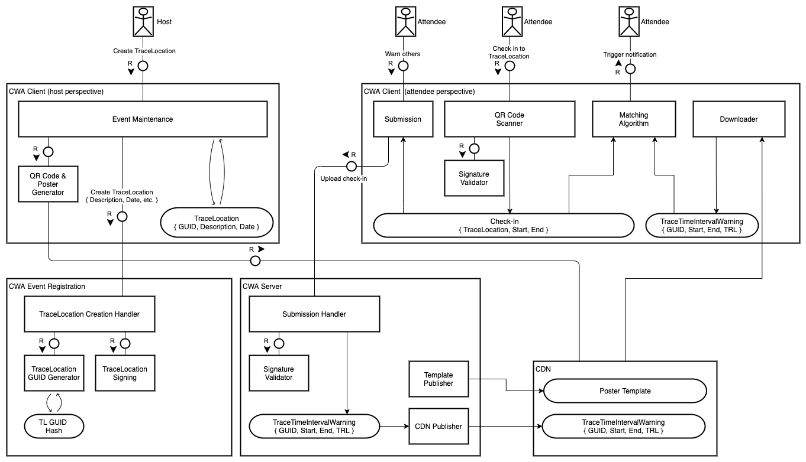

# Event Registration DRAFT - Summary

Presence Tracing - in CWA also referred to as _Event Registration_ - aims at notifying people of a potential SARS-CoV-2 exposure if they have been to the same venue at a similar time as a positively tested individual. It addresses the potential of airborne transmission in spaces with poor ventilation despite maintaining physical distance. As such, it complements BLE-based proximity tracing with the Exposure Notification Framework.

CWA proposes a fully-automated decentral solution for Presence Tracing which works independent of local health authorities and the collaboration of the host of a venue. It integrates into the existing verification processes of CWA to issue warnings. The solution prioritizes the speed of issuing warnings over their accuracy. A higher degree of accuracy would require manual assessment by local health authorities and the respective resources to do so and is currently not in scope. The solution also protects the privacy of both venues and users, as details about a venue such as description or address are not shared with the CWA infrastructure.

In summary, the proposed solution allows a _host_ to create a venue through CWA. All necessary data about the venue is encoded in a QR code which can be presented on a mobile device or printed out, for example to be posted at the entrance of the venue. An _attendee_ can check in to the venue by scanning the QR code. Check-ins are stored locally on the mobile device and deleted automatically after two weeks.

When an attendee tests positive for SARS-CoV-2, they can upload their check-ins along with their Diagnosis Keys to the CWA Server. The CWA Server publishes the relevant check-ins on CDN as _warnings_. Clients regularly download these warnings and match them against the local check-ins on the mobile device. If there is a match and the time an attendee spent at a venue overlaps with a warning for a sufficiently long time, the attendee receives a warning in CWA similar to how warnings are issued for BLE-based exposures.



## Threats WiP

Several security and privacy threats have been identified for the proposed solution. This includes common security threats such as distributed denial of service attacks or code injection, which also exist for other CWA components and are mitigated accordingly. It also includes threats specific to Presence Tracing, such as profiling venues and users or issuing false warnings for specific venues. These threats are described below along with the corresponding mitigation.

### Profiling of Venues

The proposed solution publishes warnings on CDN. A warning consists of the hashed ID of a venue and a time interval. An adversary can collect these warnings and aggregate them to compile a list of venues with the most warnings (colloquially referred to as _most infectious venues_) or a list of venues with their most recent warning.

This information is easy to collect, as warnings are publicly accessible and do not even require to make modifications to the CWA client.

The value of this information increases significantly once an adversary can link the ID of a venue with the data included in the QR code such as the name or the address of the venue, or with metadata from other services, such as coordinates of the venue.

An adversary can collect this information for a single venue by scanning the QR code and extracting and storing the data outside of CWA. Collecting this information at scale requires coordinated effort by many individuals.

Note that CWA itself does not store this data on the server or anywhere else and cannot do profiling of venues.

To mitigate the risk, CWA encourages owners to regularly generate new QR codes for their venues. The more frequent QR codes are updated, the more difficult it is to keep a central database with venue data up-to-date.

However, we acknowledge that the proposed solution does not prevent this attack with technical means.

### Profiling of Users

The proposed solution publishes warnings on CDN in packages on an hourly basis. A package includes multiple warnings. A warning consists of the hashed ID of a venue and a time interval. All warnings that were created from the check-ins of a single user are included in one package. A package can include warnings of multiple users.

An adversary can analyze the check-ins of a single package and try to build a profile of the users whose check-ins are included. This reveals limited information if the IDs of the venues cannot be linked to an actual venue (cf. [Profiling of Venues](#profiling-of-venues)), but can reveal significant information about the user the more venue IDs can be identified.

To mitigate the risk, CWA generates fake check-ins for each submission. These fake check-ins are generated upon submission of genuine check-ins so that even CWA cannot distinguish them.

However, we acknowledge that this does not prevent the attack if there is a central database of all venue IDs and venue metadata.

### Targeting Specific Venues

The proposed solution turns check-ins of the user into warnings and cannot verify if the user has actually visited the respective venue of a check-in.

An adversary can target specific venues by obtaining the respective QR code and pretending a check-in. If the adversary also obtains the authorization to submit the check-ins to the CWA Server, false warnings would be issued for these venues.

The difficulty of this attack is dominated by the difficulty of obtaining authorization to submit check-ins. This is currently only possible with a confirmed positive test for SARS-CoV-2 or by obtaining a TeleTAN from the hotline. While a confirmed positive test is difficult obtain without putting oneself at risk, a valid TeleTAN can be obtained for example by Social Engineering.

To mitigate the risk, CWA only allows a certain number of check-ins per day. This prevents to scale such an attack by a single adversary across a multitude of venues.

However, we acknowledge that this does not prevent to execute this attack for a small number of venues.

## QR Code Structure DRAFT

The QR code of a venue contains all required attributes for Presence Tracing, so that no server communication is necessary when an attendee checks in to a venue

The data structure is described by the Protocol Buffer message `QRCodePayload`:

```protobuf
message QRCodePayload {
  uint32 version = 1;
  TraceLocation locationData = 2;
  CrowdNotifierData crowdNotifierData = 3;
  // byte sequence of CWALocationData
  bytes countryData = 4;
}

message TraceLocation {
  uint32 version = 1;
  // max. 100 characters
  string description = 2;
  // max. 100 characters
  string address = 3;

  // UNIX timestamp (in seconds)
  uint64 startTimestamp = 5;
  // UNIX timestamp (in seconds)
  uint64 endTimestamp = 6;
}

message CrowdNotifierData {
  uint32 version = 1;
  uint32 type = 2;
  bytes publicKey = 3;
  bytes cryptographicSeed = 4;
}

enum TraceLocationType {
  LOCATION_TYPE_UNSPECIFIED = 0;
  LOCATION_TYPE_PERMANENT_OTHER = 1;
  LOCATION_TYPE_TEMPORARY_OTHER = 2;

  LOCATION_TYPE_PERMANENT_RETAIL = 3;
  LOCATION_TYPE_PERMANENT_FOOD_SERVICE = 4;
  LOCATION_TYPE_PERMANENT_CRAFT = 5;
  LOCATION_TYPE_PERMANENT_WORKPLACE = 6;
  LOCATION_TYPE_PERMANENT_EDUCATIONAL_INSTITUTION = 7;
  LOCATION_TYPE_PERMANENT_PUBLIC_BUILDING = 8;

  LOCATION_TYPE_TEMPORARY_CULTURAL_EVENT = 9;
  LOCATION_TYPE_TEMPORARY_CLUB_ACTIVITY = 10;
  LOCATION_TYPE_TEMPORARY_PRIVATE_EVENT = 11;
  LOCATION_TYPE_TEMPORARY_WORSHIP_SERVICE = 12;

}

message CWALocationData {
  uint32 version = 1;
  TraceLocationType type = 2;
  uint32 defaultCheckInLengthInMinutes = 3;
}
```

The ID of a venue is derived as the SHA-256 hash of the concatenated byte representation of the string `CWA-GUID` and the byte representation of the Protocol Buffer message `QRCodePayload`. The `cryptographicSeed` adds sufficient entropy so that any modifications to the QR result in a unique ID.

A `QRCodePayload` is base64-encoded and included in a URL. The URL is the content of the QR code and structures as follows:

```text
https://e.coronawarn.app?v=1#<base64_encoded>

# example:
CWA Germany:
https://e.coronawarn.app?v=1#Y3dh...
NotifyMe CH:
https://qr.notify-me.ch?v=2#bm90aWZ5bWU=
CLEA FR:
https://tac.gouv.fr?v=1#Y2xlYQ==
```

### QR Code Compatibility with Other Contract Tracing Apps in Germany DRAFT

Other contact tracing apps in Germany that leverage QR code for Presence Tracing can integrate with CWA by creating QR codes according to the following pattern:

```text
<URL>/<VENDOR_DATA>#[VENDOR_ADDITIONAL_DATA]/CWA1/<ENCODED_PAYLOAD>
```

| Parameter | Description |
|---|---|
| `<URL>` | The URL associated with the respective contact tracing apps, with or without a partial path. |
| `<VENDOR_DATA>` | Any vendor-specific data such as the venue id in the vendor's system. This data may be passed to the vendor-specific app upon interaction by the user if a deeper integration is required. |
| `[VENDOR_ADDITIONAL_DATA]` | Additional vendor-specific data (optional). |
| `<ENCODED_PAYLOAD>` | A representation of the Protocol Buffer message `QRCodePayload` encoded in base64. Note that the signature must have been created by the CWA Server. |

**Note:** Any contact tracing apps that integrate with CWA must ensure that they do not process any information from the CWA part of the QR code.

Examples:

```text
# without optional data
https://presence-tracing.app/386d0384-8aaa-41b6-93c2-d3399894d0ee#/CWA1/CiRmY2E...
  URL:                           https://presence-tracing.app
  VENDOR_DATA:                   386d0384-8aaa-41b6-93c2-d3399894d0ee
  VENDOR_ADDITIONAL_DATA:        ∅
  ENCODED_PAYLOAD:               CiRmY2E...

# with optional data
https://check-in.pt.app/386d0384-8aaa-41b6-93c2-d3399894d0ee#42/CWA1/CiRmY2E...
  URL:                           https://check-in.pt.app
  VENDOR_DATA:                   386d0384-8aaa-41b6-93c2-d3399894d0ee
  VENDOR_ADDITIONAL_DATA:        42
  ENCODED_PAYLOAD:               CiRmY2E...
```
