# CORONA-WARN-APP SOLUTION ARCHITECTURE

This document is intended for a technical audience. It represents the most **recent state of the architecture and is still subject to change** as external dependencies (e.g. the framework provided by Apple/Google) are also still changing.

The diagrams  reflect the current state but may also change at a later point in time. For some of the diagrams, [Technical Architecture Modeling (TAM)](http://www.fmc-modeling.org/fmc-and-tam) is used.

Please note that further technical details on the individual components, the security concept, and the data protection concept are provided at a later date.

We assume a close association of a mobile phone and its user and, thus, equate the device (phone, app) and the person using it (person, user, individual) and use these terms interchangeably.

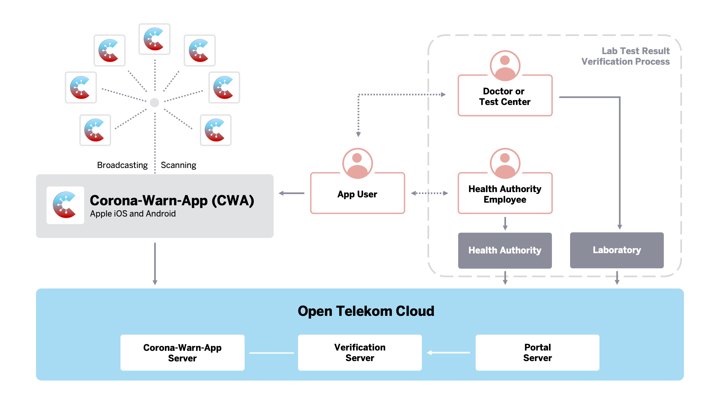

## TABLE OF CONTENTS

1. [INTRODUCTION](#introduction)
   1. [Retrieval of lab results and verification process](#retrieval-of-lab-results-and-verification-process)
   2. [Upload schedule for Diagnosis Keys](#upload-schedule-for-diagnosis-keys)
2. [BACKEND](#backend)
   1. [Data format](#data-format)
   2. [Data URL](#data-url)
   3. [Data retention](#data-retention)
3. [MOBILE APPLICATIONS](#mobile-applications)
   1. [Risk Score](#risk-score)
   2. [Data transfer and data processing](#data-transfer-and-data-processing)
4. [RUNTIME ENVIRONMENT (HOSTING)](#runtime-environment-hosting)
   1. [Bandwidth estimations](#bandwidth-estimations)
5. [CROSS-BORDER INTEROPERABILITY](#cross-border-interoperability)
6. [LIMITATIONS](#limitations)
7. [PRIVACY-PRESERVING DATA DONATION](#privacy-preserving-data-donation)

## INTRODUCTION

To reduce the spread of [COVID-19](https://www.ecdc.europa.eu/en/covid-19-pandemic), it is necessary to inform people about their close proximity to positively tested individuals. So far, health departments and affected individuals have identified possibly infected individuals in personal conversations based on each individuals' memory. This has led to a high number of unknown connections, e.g. when using public transport.

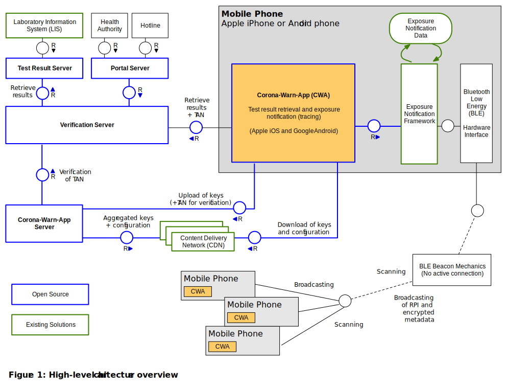

The Corona-Warn-App (see [scoping document](https://github.com/corona-warn-app/cwa-documentation/blob/master/scoping_document.md )), shown centrally in *Figure 1*, enables individuals to trace their personal exposure risk via their mobile phones. The Corona-Warn-App uses a new framework provided by Apple and Google called [Exposure Notification Framework](https://www.apple.com/covid19/contacttracing). The framework employs [Bluetooth Low Energy (BLE)](https://en.wikipedia.org/wiki/Bluetooth_Low_Energy) mechanics. BLE lets the individual mobile phones act as beacons meaning that they constantly broadcast a temporary identifier called Rolling Proximity Identifier (RPI) that is remembered and, at the same time, lets the mobile phone scan for identifiers of other mobile phones. This is shown on the right side of *Figure 1*.
Identifiers are ID numbers sent out by the mobile phones. To ensure privacy and to prevent the tracking of movement patterns of the app user, those broadcasted identifiers are only temporary and change constantly. New identifiers are derived from a Temporary Exposure Key (TEK) that is substituted at midnight (UTC) every day through means of cryptography. For a more detailed explanation, see *Figure 10*. Once a TEK is linked to a positive test result, it remains technically the same, but is then called a Diagnosis Key.

The collected identifiers from other users as well as the own keys, which can later be used to derive the identifiers, are stored locally on the phone in the secure storage of the framework provided by Apple and Google. The application cannot access this secure storage directly, but only through the interfaces the Exposure Notification Framework provides. To prevent misuse, some of these interfaces are subjected to [rate limiting](https://developer.apple.com/documentation/exposurenotification/enmanager/3586331-detectexposures). If  app users are tested positively for SARS-CoV-2, they can update their status in the app by providing a verification of their test and select an option to send their recent keys from up to 14 days back. On the Corona-Warn-App back-end server, all keys of positively tested individuals are aggregated and are then made available to all mobile phones that have the app installed. Additionally, the configuration parameters for the framework are available for download, so that adjustments to the risk score calculation can be made, see the *Risk Scores* section.
Once the keys and the exposure detection configuration have been downloaded, the data is handed over to the Exposure Notification Framework, which analyzes whether one of the identifiers collected by the mobile phone matches those of a positively tested individual. Additionally, the metadata that has been broadcasted together with the identifiers such as the transmit power can now be decrypted and used. Based on the collected data, the Exposure Notification Framework provided by Apple and Google calculates a risk score for each individual exposure as well as for the overall situation. Exposures are defined as an aggregation of all encounters with another individual on a single calendar day (UTC timezone). For privacy reasons, it is not possible to track encounters with other individuals across multiple days.

It is important to note that the persons that have been exposed to a positively tested individual are **not informed by a central instance**, but the risk of an exposure is calculated locally on their phones. The information about the exposure remains on the user’s mobile phone and is not shared.

The Corona-Warn-App pursues two objectives:

1. It supports individuals in finding out whether they have been exposed to a person that has later been tested positively.
2. It receives the result of a SARS-CoV-2 test on a user's mobile phone through an online system. This helps reduce the time until necessary precautions, e.g. a contact reduction and testing, can be taken.

In order to prevent misuse, individuals need to provide proof that they have been tested positively before they can upload their keys. Through this integrated approach, the verification needed for the upload of the diagnosis keys does not require any further action from the users.
They only have to confirm in the app and for the Exposure Notification Framework that they agree to share their diagnosis keys. Manual verification is also possible if the lab that performed the testing does not support the direct electronic transmission of test results to the users' mobile phones or if users have decided against the electronic transmission of their test results.

### Retrieval of Lab Results and Verification Process

Reporting positive tests to the Corona-Warn-App is crucial for informing others about a relevant exposure and potential infection. However, to prevent misuse, a verification is required before diagnosis keys can be uploaded.
There are two ways for receiving this verification:

1. Using the integrated functionality of the Corona-Warn-App to retrieve the results of a SARS-CoV-2 test from a verification server (see Figure 2, Step 4a). With this integration, the positive test result is already verified and the diagnosis keys can be uploaded right after the users have given their consent.
2. Providing a human-readable token, e.g. a number or a combination of words, as verification to the app. This token is called teleTAN (see Figure 2, Step 4b).

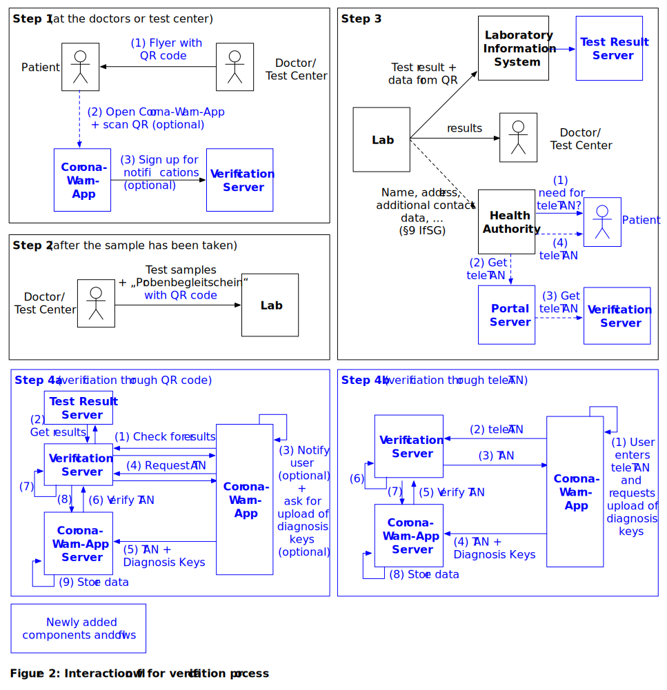

*Figure 2* and *Figure 3* illustrate the verification process. *Figure 2* shows the interaction flow of the user and *Figure 3* the flow and storage of data. Additions to the preexisting 'conventional' process through the introduction of the Corona-Warn-App and the integrated test result retrieval are marked blue in *Figure 2*.

This preexisting process for the processing of lab results includes that the doctor requesting the test also receives the results, so patients can be informed in a timely manner. As required by law ([§9 IfSG](https://www.gesetze-im-internet.de/ifsg/__9.html)), the responsible health authority (“Gesundheitsamt”) is notified by the lab about the test results as well. The notifications in case of a positive test includes, amongst others, the name, address, and date of birth of the positively tested individuals, so that they can be contacted and informed about the implications of their positive test. This is also represented in step 3 of *Figure 2*.

The flow for using the app is as follows, referencing the steps from *Figure 2*:

- **Step 1:** Users of the Corona-Warn-App (i.e. broadcasting and collecting RPIs)
  - (1) When a test is conducted, they receive an information flyer with a custom QR code. The code is either created on-site or is already available as a stack of pre-printed QR codes. The QR code contains a globally unique identifier (GUID).
  - (2) Optionally, they can scan the QR code with the Corona-Warn-App (*Figure 3*, step 1). If users decide against using the test retrieval functionality of the Corona-Warn-App, they still receive their test results through the regular channels explained before.
  - (3) When the code is scanned, a web service call (REST) is placed against the Verification Server (*Figure 3*, step 2), linking the mobile phone with the data from the QR code through a registration token, which is generated on the server  (*Figure 3*, step 3) and stored on the mobile phone  (*Figure 3*, step 4).
- **Step 2:** The samples are transported to the lab together with a “Probenbegleitschein” which has a machine-readable QR code on it as well as other barcodes (lab ID, sample IDs).
- **Step 3:** As soon as the test result is available meaning the samples have been processed, the software running locally in the lab (lab client) transmits the test result to the Laboratory Information System together with the GUID from the QR code. The Laboratory Information System hashes the GUID and posts it together with the test result to the Test Result Server through a REST interface (*Figure 3*, step A), which in turn makes it available to the verification server.
- **Step 4a:** After signing up for notifications in step 1, the user’s mobile phone regularly checks the Verification Server for available test results (polling, figure 3, steps 5-8). This way, no external push servers need to be used. If results are available, the user is informed that information is available. The result themselves as well as recommendations for further actions are only displayed after the user has opened the app (see the scoping document for more details).
- If the test returns a positive result, users are asked to upload their keys to allow others to find out that they were exposed. If the users agree, the app retrieves a short-lived token (TAN) from the Verification Server (see also *Figure 3*, steps 9-13). As the Verification Server does not persist the test result, it is fetched from the Test Result Server once more (*Figure 3*, steps 10-11).
The TAN is used as authorization in the HTTP header of the POST request for upload of the diagnosis keys of the last 14 days to the Corona-Warn-App Server (*Figure 3*, step 14).
- The Corona-Warn-App Server uses the TAN to verify the authenticity (*Figure 3*, steps 15-17) of the submission with the Verification Server.
  - The TAN is consumed by the Verification Server and becomes invalid (*Figure 3*, step 16).
  - If the Corona-Warn-App Server receives a positive confirmation, the uploaded diagnosis keys are stored in the database (*Figure 3*, step 18).
  - The TAN is never persisted on the Corona-Warn-App Server.
  - In case of a failing request, the device receives corresponding feedback to make the user aware that the data needs to be re-submitted.

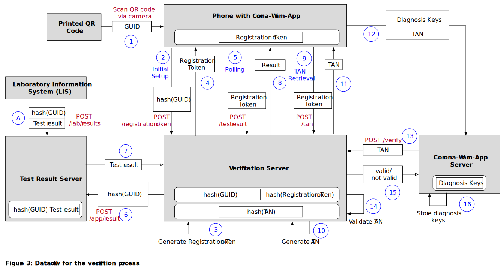

Note regarding *Figure 3* and *Figure 4*: The white boxes with rounded corners represent data storage. The HTTP method POST is used instead of GET for added security, so data (e.g. the registration token) can be transferred in the body.

As mentioned before, users might have decided against retrieving test results electronically, or the lab may not support the electronic process. Step 3 of *Figure 2* shows that in these cases the health authority (“Gesundheitsamt”) reaches out to the patient directly. Also during this conversation, the teleTAN can be provided to the patient, which can be used to authorize the upload of diagnosis keys from the app to the Corona-Warn-App Server (step 4b of *Figure 2*). This process is also visualized in *Figure 4*. Whenever patients are contacted regarding a positive test result, they can choose to receive a teleTAN. The teleTAN is retrieved from the web interface (*Figure 4*, step 1) of the portal service by a public health officer. This service in turn is requesting it from the Verification Server (2-3). The teleTAN is then issued to the officer (4-5) who transfers it to the patient (6). Once the patient has entered the teleTAN into the app (7), it uses the teleTAN to retrieve a registration token from the Verification Server (8-10). Once the user has confirmed the upload of the Diagnosis Keys, the application requests a TAN from the server, using the registration token (11-13). This TAN is needed by the server to ensure that the device is allowed to do the upload. These TANs are not visible to the user. After uploading the TAN and the diagnosis keys to the Corona-Warn-App Server (14), the Corona-Warn-App Server can verify the authenticity of the TAN with the Verification Server (15-16) and upon receiving a confirmation, store the diagnosis keys in the database (17).

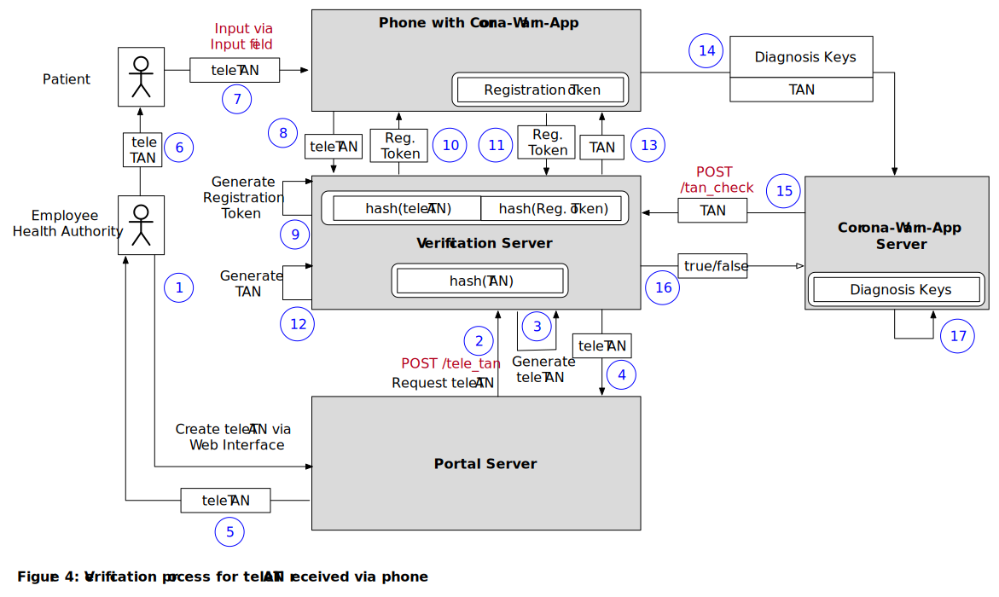

The retrieval of the registration token ensures a coupling between a specific mobile phone and a GUID/teleTAN, preventing others (even when they have the QR code) to retrieve test results and/or to generate a TAN for uploading diagnosis keys. Upon the first connection with the Verification Server, a registration token is generated on the server and sent back to the client. In the information they receive, the patients should be asked to scan the QR code as soon as possible, as all further communication between client and server only uses the registration token which can only be created once.
If a user deletes and reinstalls the app, the stored registration token is lost, making it impossible to retrieve the test results. In this case the fallback with the health authority workflow (through a hotline) needs to be used.
From a privacy protection perspective, sending push notifications via Apple’s or Google’s push service is not acceptable in this scenario. Even though no specific test results are included in the notifications, the message itself signals that the user has taken a SARS-CoV-2 test. Thus, polling and local notifications are used instead. If a user also decides against local notifications, a manual update of the test results is also possible.

If a user did not receive a teleTAN from the health authority and/or has lost the QR code, a teleTAN needs to be retrieved from a hotline. The hotline ensures that users are permitted to perform an upload before issuing the teleTAN. It is then used as described before, starting from *Figure 4*, step 7.

### Upload Schedule for Diagnosis Keys

According to the current version of the documentation from Apple and Google (1.3), the first set of up to 14 Temporary Exposure Keys (TEK; called Diagnosis Keys when linked to a positive test) needs to be uploaded after the positive test result becomes available and the consent to the upload has been given (see (1) in *Figure 5*). As the TEK of the current day can still be used to generate new RPIs, it cannot be made available right away. If it was uploaded before the end of the day, malicious third parties could use it to generate valid RPIs linked to a positive test. Instead, once it is uploaded, it is replaced by a new TEK (see (2) in *Figure 5*). This upload takes place in the background and requires no additional consent as the framework grants a 24-hour grace period for the request of Diagnosis Keys.

")

As users are not required to confirm negative test results, the functionality of uploading Diagnosis Keys on subsequent days remains theoretical. Each of those uploads could take place earliest at the end of each subsequent day (see (3) in *Figure 5*). It would require explicit consent of the user for each day and could take place up to the time when the person is not considered contagious anymore (but not any longer, as this would lead to false positives).

As of now, two uploads are required from the same mobile phone (past diagnosis keys and from the current day). This means, the registration token may not be invalidated after the first upload, but must remain active. The TANs sent to the Corona-Warn-App Server are only valid for a single use. In case of the teleTAN, an additional registration token is created which then allows the app to retrieve TANs for individual uploads.

## Back End

")

The Corona-Warn-App Server needs to fulfill the following tasks:

- Accept upload requests from clients
  - Verify association with a positive test through the Verification Server and the associated workflow as explained in the “Retrieval of Lab Results and Verification Process” section and shown in the center of the left side of *Figure 6*.
  - Accept uploaded diagnosis keys and store them (optional) together with the corresponding transmission risk level parameter (integer value of 1-8) into the database. Note that the transport of metadata (e.g. IP) of the incoming connections for the upload of diagnosis keys is removed in a dedicated actor, labeled “Transport Metadata Removal” in *Figure 6*.
- Provide [configuration parameters](#data-format) to the mobile applications
  - Threshold values for [attenuation buckets](#attenuation-buckets)
  - Risk scores for defined values
  - Threshold values for risk categories and alerts
  - Valid country codes for EFGS Visited Countries
- On a regular schedule (e.g. hourly)
  - Assemble diagnosis keys into chunks for a given time period
  - Store chunks as static files (in protocol buffers, compatible with the format specified by Apple and Google)
  - Transfer files to a storage service as shown at the bottom of *Figure 6* which acts as a source for the Content Delivery Network (CDN)
- Handle the integration with the [European Federation Gateway Service](https://github.com/eu-federation-gateway-service/efgs-federation-gateway) which consists of:
  - Downloading keys which are shared from connected countries and making them available for use by the CWA Mobile applications
  - Upload relevant keys for DE to the service to share with other connected countries
  - Expose a callback API which can be used by the EFGS to notify CWA when new key batches are available for download
  - Handle the translation of keys values for DSOS and TRL

Those tasks relevant for interaction with the CWA Mobile application are visualized in *Figure 7*. Each of swim lanes (vertical sections of the diagram) on the left side (Phone 1, Phone 2, Phone n) represents one device that has the Corona-Warn-App installed. The user of Phone 1 has taken a SARS-CoV-2 test (which comes back positive later). The users of Phone 2 and Phone n only use the functionality to trace potential exposure.
The Corona-Warn-App Server represents the outside picture of the individual service working in the back end. For a better understanding, the database has been visualized separately.

 with the back-end servers and CDN")

Note that even if a user has not been tested positive, the app randomly submits requests to the Corona-Warn-App Server (represented in *Figure 7* by Phone 2) which on the server side can easily be ignored, but from an outside perspective exactly looks as if a user has uploaded positive test results. This helps to preserve the privacy of users who are actually submitting their diagnosis keys due to positive test results. Without dummy requests, a malicious third party monitoring the traffic could easily find out that users uploading something to the server have been infected. With our approach, no pattern can be detected and, thus, no assumption can be taken.

If diagnosis keys need to be uploaded on subsequent days of the submission of a positive test result, also that behavior should be represented within the random (dummy) submissions.

It could be possible to identify temporary exposure keys that belong together, i.e. belong to the same user, because they are posted together which results in them being in a sequential order in the database.
To prevent this, the aggregated files are shuffled, e.g. by using an ORDER BY RANDOM on the database while fetching the data for the corresponding file.
Alternatively, returning them in the lexicographic order of the RPIs (which are random) is a valid option as well. The latter might be more efficient for compressing the data afterwards.

The configuration parameters mentioned above allow the health authorities to dynamically adjust the behavior of the mobile applications to the current epidemiological situation. For example, the risk score thresholds for the risk levels can be adjusted, as well as how the individual data from exposure events influence the overall score.

Further information can be found in the dedicated architecture documents for the Corona-Warn-App Server, the Verification Server, and the Portal Server. The documents will be linked here, as soon as they are available.

### Data Format

The current base unit for data chunks will be one hour. Data will be encoded in the protocol buffer format as specified by Apple and Google (see *Figure 8*). It is planned that in case a data chunk does not hold any or too few diagnosis keys, the chunk generation will be skipped.

The server will make the following information available through a RESTful interface:

- Available items through index endpoints (not all implemented in first iteration)
- Newly-added Diagnosis Keys (Temporary Exposure Keys) for the time frame
- Configuration parameters
  - 32 parameters for configuring the risk score of the Apple/Google Exposure Notification Framework
  - [Attenuation bucket](#attenuation-buckets) thresholds
  - Risk score threshold to issue a warning
  - Risk score ranges for individual risk levels

Return data needs to be signed and will contain a timestamp (please refer to protocol buffer files for further information). Using index endpoints will not increase the number of requests, as they can be handled within a single HTTP session. In case the hourly endpoint does not hold diagnosis keys for the selected hour, the mobile application does not need to download it. If, on the other hand multiple files need to be downloaded (e.g. because the client was switched off overnight), they can be handled in a single session as well.

In order to ensure the authenticity of the files, they need to be signed (according to the specifications of the API) on server side with a private key, while the app uses the public key to verify that signature. To ensure roaming qualities (protocol interoperability with servers in other geographical regions), it is planned to move to a single agreed protocol once finally defined.

 specified by Apple/Google")

### Data URL

Retrieving the data in a RESTful format, making it clearer to make it available through a transparent CDN (only requesting the files once).

If no diagnosis keys are available for the selected parameters, but the time frame has already passed, a signed payload with a timestamp and an empty list of diagnosis keys is returned. As this file is also signed by the server and, through the timestamp, is also different from other files without diagnosis keys, its authenticity can be verified.

Further details of the API are explained in the documentation of the Corona-Warn-App Server.

### Data Retention

The data on all involved servers is only retained as long as required. Diagnosis Keys will be removed from the Corona-Warn-App Server when they refer to a period of more than 14 days ago. TANs on the Verification Server will be removed as soon as they have been used. The hashed GUID on the Verification Server needs to be retained as long as the GUID can be used to retrieve test results from the test result server. Otherwise, a second upload privilege, i.e. a registration token, could be fetched with the same GUID.

## MOBILE APPLICATIONS

The functional scope of the mobile applications (apps) is defined in the corresponding [scoping document](https://github.com/corona-warn-app/cwa-documentation/blob/master/scoping_document.md). The apps are developed natively for Apple’s iOS and Google’s Android operating systems. They make use of the respective interfaces for the exposure notification, i.e. broadcasting and scanning for Bluetooth advertisement packages, see *Figure 9*.

For Apple devices an OS version of at least 13.5 will be required for the system to work, as the framework is integrated into the operating system.

For Android devices, the features will be integrated into the [Google Play Services](https://9to5google.com/2020/04/13/android-contact-tracing-google-play-services/), which means that only this specific application needs to be updated for it to work. Devices starting with Android 6.0 (API version 23) and integrated BLE chips will be [supported](https://developers.google.com/android/exposure-notifications/exposure-notifications-api#architecture).

")

The app itself does not have access to the collected exposures, i.e. the Rolling Proximity Identifiers, and neither is it informed if a new one has been collected by the framework. As depicted in the *Figure 10* and *Figure 11*, the Exposure Notification encapsulates handling of the keys, including all cryptographic operations on them. The only output of the black box upon an infection is a collection of temporary exposure keys as shown in *Figure 10*. Those are subsequently called diagnosis keys.

")

The encapsulation especially applies to the part where matches are calculated, as the framework only accepts the diagnosis keys as input, matches them to (internally stored) RPIs and returns a list of exposure events without a link to the corresponding Rolling Proximity Identifiers (see *Figure 11*). With the use of the corresponding Associated Encrypted Metadata Key, the Associated Encrypted Metadata (AEM) of the captured RPI can be decrypted. This metadata contains the transmission power (which is used to calculate the attenuation). Additionally, an epoch (usually a 24 hour window) for the exposure is determined, as well as the duration of the exposure in 5-minute increments (capped at 30 minutes).

")

[Information provided from the framework API to the app per exposure](https://covid19-static.cdn-apple.com/applications/covid19/current/static/contact-tracing/pdf/ExposureNotification-FrameworkDocumentationv1.2.pdf):

- **Attenuation value** (Reported Transmit Power - Measured RSSI)
- **Attenuation “buckets”**, i.e. times spent within certain attenuation ranges (see below)
- **Date** when the exposure occurred (with reduced precision, i.e. one day)
- **Duration** of the exposure (<5/5/10/15/20/25/30/>30 minutes)
- **Transmission risk level** associated with diagnosis key of other person (downloaded from server, together with diagnosis key)
- **Total Risk Score** calculated exposure risk level (with a range from 0-4096) according to the defined parameters

### Attenuation Buckets

Both, Apple and Google allow to define a low and a high threshold for the attenuation, forming three individual buckets:

- Attenuation < low threshold
- Low threshold <= attenuation < high threshold
- High threshold <= attenuation

While in the Google implementation of the Exposure Notification Framework, those buckets are contained within the `ExposureSummary` (`attenuationDurations`), Apple has added them to the [`metadata`](https://developer.apple.com/documentation/exposurenotification/enexposureinfo/3586326-metadata) attribute of the [`ENExposureInfo`](https://developer.apple.com/documentation/exposurenotification/enexposureinfo).
In the latter implementation, the [`attenuationDurations`](https://developer.apple.com/documentation/exposurenotification/enexposureinfo/3586325-attenuationdurations) of the `ENExposureInfo` contains two buckets around a fixed threshold of 50.

### Risk Score Calculation

The information listed above is not visible to the user, but is used internally to calculate a risk score, which again is mapped to one specific app-defined risk level. This easy-to-understand risk level is displayed to the user. Further information regarding the individual exposure events (such as the matched Rolling Proximity Identifier, the Temporary Exposure Key or the exact time) remains within the secure storage of the framework and cannot be retrieved by the application.

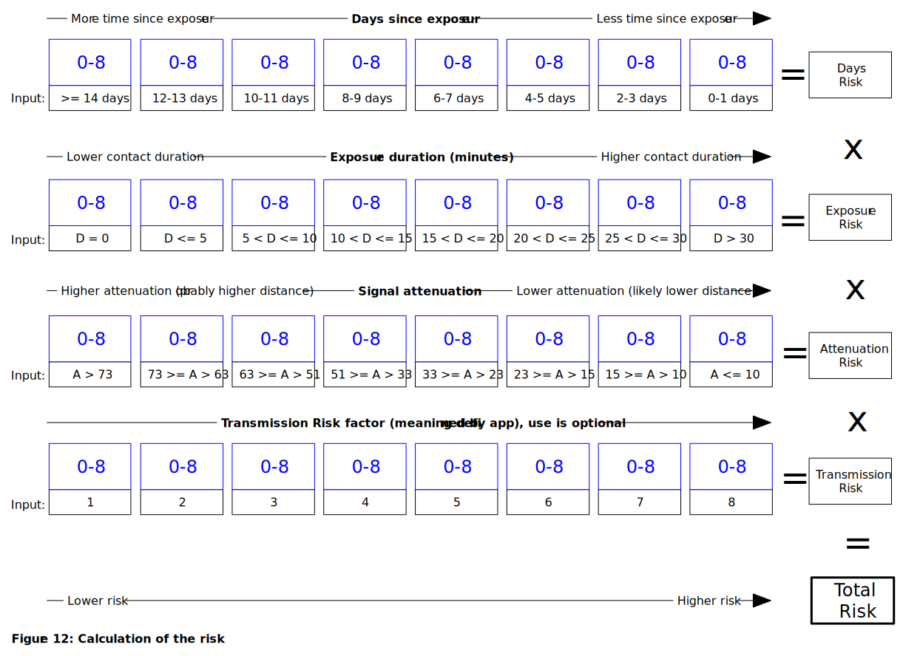

*Figure 12* displays how the total risk score is being calculated. The application is provided with a set of parameters, which are marked in blue within the figure.
Those parameters are regularly downloaded from the CWA Server, which means they can be modified without requiring a new version of the application (see [`exposure-config.yaml`](https://github.com/corona-warn-app/cwa-server/blob/master/services/distribution/src/main/resources/main-config/exposure-config.yaml) for details).
Each of the four risk categories (days since exposure, exposure duration, weighted signal attenuation, and the transmission risk factor) receives an input value from the event which is then mapped to a predefined input value interval.
 Each of those input value intervals is then assigned a risk score from 0-8, where 0 represents a very low risk and 8 represents a very high risk. This means that from each of the rows in the figure, one value is selected according to the input value for the corresponding category. As an example: an exposure duration input value of D=15.3 minutes is mapped to the interval 15 < D <= 20, which in the current implementation has a value of 1 assigned to it, i.e. the *Exposure Risk* would be equal to 1 in this example. The product of the four risk scores is used as the **total risk score** of the individual exposure.

According to the [documentation of the framework](https://developer.apple.com/documentation/exposurenotification/enexposureconfiguration), "the attenuation is weighted by the duration at each risk level and averaged for the overall duration". In order to incorporate the time spent within the ranges of attenuation buckets mentioned before, each of those three buckets is assigned a weight value as shown in *Figure 13*.
 The individual time values are multiplied with their according weight (*weight_1*, *weight_2* and *weight_3*).
 Their sum and a default bucket offset (called *weight_4* in *Figure 13*) forms the *Exposure Score*.
Finally, the maximum of the *total risk score* over all the considered events, i.e. the largest risk score, is normalized and then multiplied with the above exposure score. The resulting product of the *exposure score* and the *normalized maximum total risk score* then forms the so called **combined risk score**.

The combined risk score is used to determine which defined risk level should be displayed to the user, e.g. “low risk” or “high risk”. For this decision, [app-defined thresholds](https://github.com/corona-warn-app/cwa-server/blob/master/services/distribution/src/main/resources/main-config/risk-score-classification.yaml) for the individual risk levels apply.
As the values above are multiplied with each other, a single category with a risk score of 0 means that the overall risk score is also 0.
Additionally, a central threshold for the combined risk score specifies whether an exposure event should be considered or not.
Furthermore the Google/Apple framework allows to set a [```minimalRiskScore```](https://developer.apple.com/documentation/exposurenotification/enexposureconfiguration/3583692-minimumriskscore) to exclude exposure incidents with scores lower than the value of this property.
In the current version of the API the time spent within the ranges of attenuation buckets are accumulated over all exposure incidents during one matching session.
Since the number of requests is currently limited, it is not possible to get these values for each day and each exposure incident separately.
While by default there is no minimum value set, this value is being configured accordingly, so that presumably irrelevant exposure incidents are excluded.

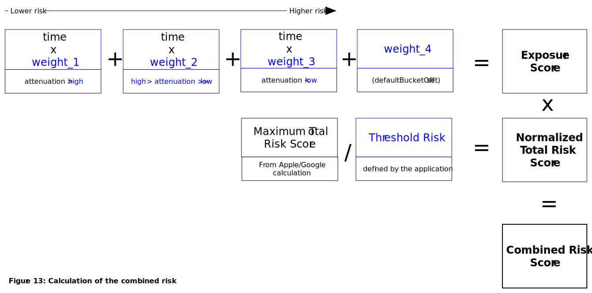

Note that the transmission risk level plays a special role in the above calculations: It can be defined by the app and be associated with each individual diagnosis key (i.e. specific for each day of an infected person) that is being sent to the server. It contains a value from 1 to 8, which can be used to represent a calculated risk defined by the health authority. As an example it could contain an estimate of the infectiousness of the potential infector at the time of contact and, hence, the likelihood of transmitting the disease. The specific values are defined as part of the [app](https://github.com/corona-warn-app/cwa-app-android/blob/master/Corona-Warn-App/src/main/java/de/rki/coronawarnapp/util/ProtoFormatConverterExtensions.kt) - a motivation of the parameter choices is found in the document [Epidemiological Motivation of the Transmission Risk Level](https://github.com/corona-warn-app/cwa-documentation/blob/master/transmission_risk.pdf).

### Data Transfer and Data Processing

In order to be able to regularly match the RPIs associated with positive tests (derived from Diagnosis Keys) against the RPIs stored in the framework, the mobile applications need to download the former regularly.

In order to prevent load peaks in the back end, the downloads need to be spread evenly across the set time interval (currently an hour). To achieve that, each client needs to randomly decide on a point of time within the given hour, when it will download the data. With a large number of clients, this should statistically lead to an even distribution of requests.

However, [Apple’s background tasks](https://developer.apple.com/documentation/backgroundtasks) don’t allow a specific point of time when the download task shall be distributed, but instead only let the developer define a [minimum time interval](https://developer.apple.com/documentation/backgroundtasks/bgtaskrequest/3142244-earliestbegindate) after which the tasks should be executed. Even though exact execution times cannot be guaranteed, we expect a behavior as specified above.

To ensure that as few requests as absolutely necessary are made, the earliest point in time should be at the beginning of the next availability interval. A random number should be added to ensure that the earliest start dates are spread evenly across all clients. For an hourly interval this could be calculated as follows:

`minimum seconds until execution = (seconds until beginning of next interval) + random(3600)`

In some scenarios, it is possible that a client has been unable to retrieve data for one or more intervals. This might be due to the device being turned off, background activations not firing automatically (e.g. during the night, as described above), or unavailability of an internet connection. It is very important that the client ensures that after one of those breaks, all available data is being caught up to and a match for the last 14 days might be contained.

In case the download of the diagnosis keys and the exposure detection configuration from the server fails, the client application needs to retry gracefully, i.e. use a random time component for the retry, as well as extending retry intervals. However, it needs to be ensured that all diagnosis keys are downloaded from the server. Otherwise, possible matches could be skipped.

Further details can be found in the dedicated architecture documents for the mobile applications.

## RUNTIME ENVIRONMENT (HOSTING)

The back end will be made available through the [Open Telekom Cloud (OTC)](https://open-telekom-cloud.com/).

For the operation of the back end, several bandwidth estimations need to be taken. As a high adoption rate of the app is an important requirement, we are considering up to 60 million active users.

### Bandwidth Estimations

While each set of 14 diagnosis keys only has the small size of 392 bytes, all newly submitted diagnosis keys of a time period need to be downloaded by all mobile phones having the application installed. When considering 2000 new cases for a day, a transmission overhead (through headers, handshakes, failed downloads, etc.) of 100% and 30 million clients, this adds up to approximately 1.5MB per client, i.e. **42.8TB** of overall traffic. If a day is split into 24 chunks (one per hour), this results in a total number of **720 million requests per day**. If the requests are evenly spread throughout the corresponding hour, approximately **8,500 session requests** per second need to be handled. Detailed descriptions of the connections can be found in the chapter ["Data transfer and data processing"](#data-transfer-and-data-processing). Those number exclude possible interoperability with other countries.

If the back end calls from the mobile applications cannot be spread as evenly as we expect, we might experience peaks. To achieve an even spread (and to be able to handle a peak), we will employ a Content Delivery Network (CDN) by T-Systems to make the individual aggregated files available. According to an evaluation with T-Systems, the estimated throughput and request number can be handled by their infrastructure.

## Cross-Border Interoperability

A definite prerequisite for compatibility is that the identifiers of the mobile devices can be matched, i.e. the GAEN framework by Apple and Google is being used.

[Most European countries are developing similar contact tracing apps](https://ec.europa.eu/info/live-work-travel-eu/health/coronavirus-response/travel-during-coronavirus-pandemic/mobile-contact-tracing-apps-eu-member-states_en). These apps may use the common frameworks by Google and Apple, enabling transmission and detection of GAEN format diagnosis keys between devices running different contact tracing applications.
Each country has its own separate database, which contains the keys from infected individuals. In order to coordinate exposure information between countries, a common service is required to enable interoperability.
The [European Federation Gateway Service (EFGS)](https://github.com/eu-federation-gateway-service/efgs-federation-gateway) enables interoperability of diagnosis keys between the connected country backend servers.

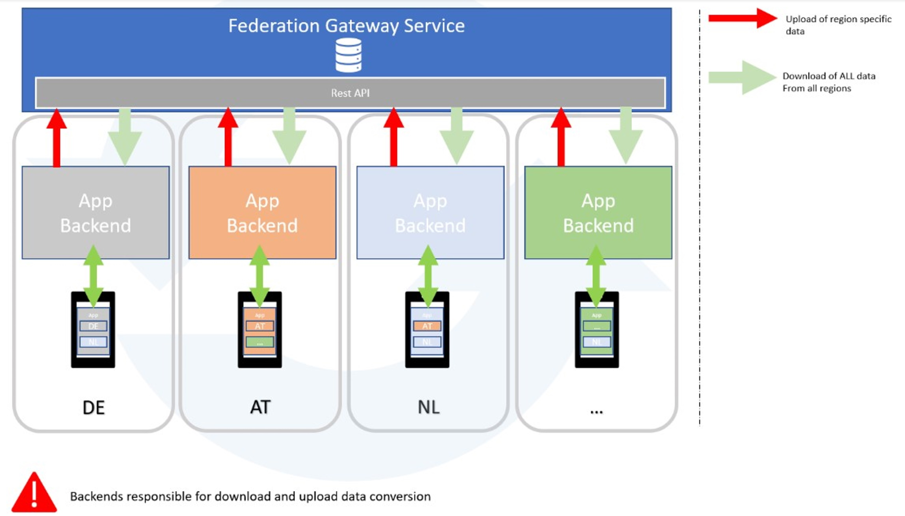

The Federation Gateway Service facilitates backend-to-backend integration. Countries can onboard incrementally, while the national backends retain flexibility and control over data distribution to their users.
For example, if a German citizen visits France and then becomes infected, the keys of the German citizen are then relevant for the citizens of France. In this case the German citizen keys would be shared with the EFGS to enable the French backend to obtain the keys. Similarly, if a French user is visiting Germany, that user's keys are of relevance to the German database.

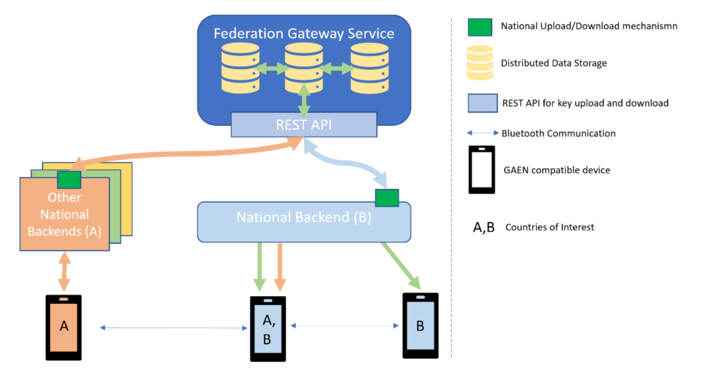

In the example above, user A from country A travels to country B and afterwards tests positive. Only the relevant users (those which came within proximity of the infected user A) in Country B will receive the alert.
Devices only communicate with their country's backend. That country's backend is then responsible to send relevant keys to the EFGS.
All connected countries provide keys to the EFGS. The EFGS then makes available relevant keys to each additional connected country's backend. Notifications and alerts are handled by each individual country's backend.
The EFGS stores information of all currently infected citizens along with a list of countries they visited.
In order for the EFGS to function correctly, all users must specify their visited countries correctly (either manually or automatically).

## LIMITATIONS

Even though the system can support individuals in finding out whether they have been in proximity with a person that has been tested positively later on, the system also has limits (shown in *Figure 14*) that need to be considered. One of those limitations is that while the device constantly broadcasts its own Rolling Proximity Identifiers, it only listens for others in defined time slots. Those [listening windows are currently up to five minutes](https://covid19-static.cdn-apple.com/applications/covid19/current/static/contact-tracing/pdf/ExposureNotification-BluetoothSpecificationv1.2.pdf) apart and are defined as being only very short. In our considerations we expect the windows to have a length of two to four seconds. For the attenuation, the two buckets provided by the framework are being considered. A lower attenuation means that the other device is closer; we assume that an attenuation <58 dB translates to a distance below two meters. A higher attenuation might either mean that the other device is farther away (i.e. a distance of more than two meters) or that there is something between the devices blocking the signal. This could be objects such as a wall, but also humans or animals.

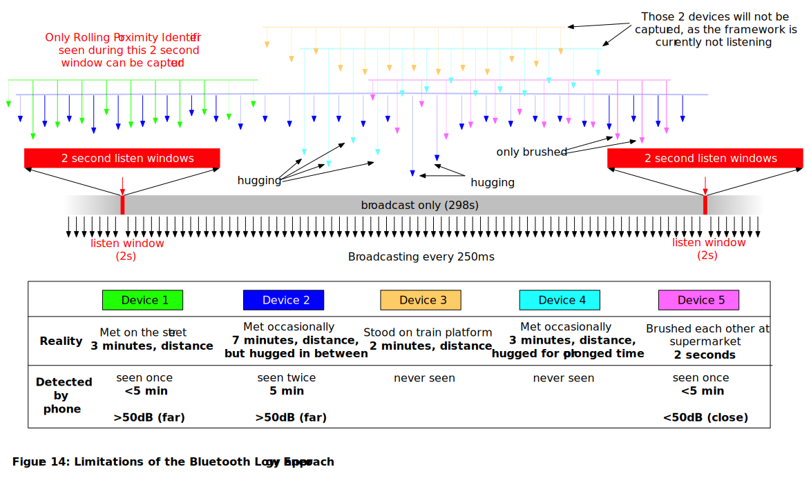

In *Figure 14*, this is visualized, while focusing on the captured Rolling Proximity Identifiers by only a single device. We are assuming that devices broadcast their own RPI every 250ms and use listening windows with a length of two seconds, five minutes apart. There are five other active devices – each representing a different kind of possible exposure. In the example, devices 3 and 4 go completely unnoticed, while a close proximity with the user of device 2 cannot be detected. In contrast to that very brief, but close connection with the user of device 5 (e.g. only brushing the other person in the supermarket) is noticed and logged accordingly. The duration and interval of scanning needs to be balanced by Apple and Google against battery life, as more frequent scanning consumes more energy.

It must be noted that some of the encounters described above are corner cases. While especially the cases with a very short proximity time cannot be detected due to technical limitations, the framework will be able to detect longer exposures. As only exposures of longer duration within a certain proximity range are considered relevant for the intended purpose of this app, most of them will be covered.

## PRIVACY-PRESERVING DATA DONATION

The concept of Privacy-preserving Data Donation (PPDD) addresses the need to gain insight into the effecitveness of the Corona-Warn-App. 

It consists of two components:

- **Event-driven User Surveys** (EDUS) - allowing users to participate in a survey if they have received a warning about a high-risk encounter. 
  
  Among others, the survey contains questions regarding the user's behavior in the days preceding the warning and about next steps the user might take, such as seeing a doctor, taking a test, etc.

- **Privacy-preserving Analytics** (PPA) - allowing users to share metrics of the risk calculation, test result delivery, and key submission behavior.

  For example, this includes the current risk level and date of the most recent encounter or whether a test has been registered, how long it took until the result was made available.

Both EDUS and PPA are separate and optional features that require users to actively opt-in. No data is collected without prior consent and any pending data is discarded once a consent is withdrawn.

A dedicated **CWA Data Donation Server** processes the requests relating to Privacy-preserving Data Donation. Access to the APIs is restricted to the Corona-Warn-App by a concept called **Privacy-preseving Access Control** (PPAC). It requires clients to provide an authenticity proof of the device and of the Corona-Warn-App. The access is denied if the authenticity proof is not valid.

The authenticity proof is OS-specific and uses native capabilities:

- iOS clients leverage the Device Identification API to authorize an API Token for the current month; the use of the API Token is rate-limited

- Android clients leverage the SafetyNet Attestation API to provide an integrity verdict about the device and the client

The following diagram shows the individual components and their interaction:

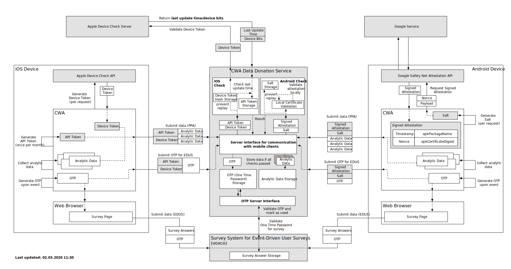