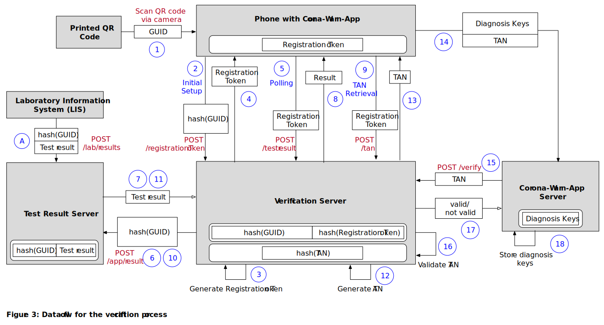
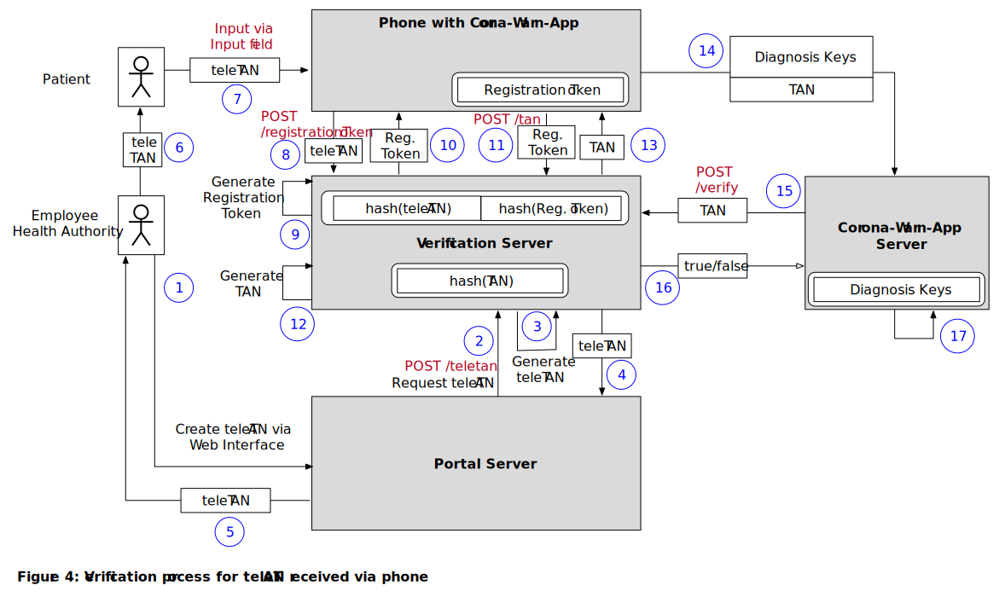

# CORONA-WARN-APP SOLUTION ARCHITECTURE

This document is intended for a technical audience and represents the most **recent state of the architecture, which might not be final yet**, as external dependencies (e.g. the framework provided by Apple/Google) are still changing.

Diagrams  reflect the current state but might as well change at a later point of time. [Technical Architecture Modeling (TAM)](http://www.fmc-modeling.org/fmc-and-tam) is used for some of the diagrams.

Please note that further technical details on the individual components, the security concept and the data protection concept will be made available at a later date.

Assuming a close association of a mobile phone and its user, we equate the device (phone, app) and the person using it (person, user, individual) and use these terms interchangeable. 

## TABLE OF CONTENTS
1. [INTRODUCTION](#introduction)
   1. [Retrieval of lab results and verification process](#retrieval-of-lab-results-and-verification-process)
   2. [Upload schedule for Diagnosis Keys](#upload-schedule-for-diagnosis-keys)
2. [BACKEND](#backend)
   1. [Data format](#data-format)
   2. [Data URL](#data-url)
   3. [Data retention](#data-retention)
3. [MOBILE APPLICATIONS](#mobile-applications)
   1. [Risk Score](#risk-score)
   2. [Data transfer and data processing](#data-transfer-and-data-processing)
4. [RUNTIME ENVIRONMENT (HOSTING)](#runtime-environment-hosting)
   1. [Bandwidth estimations](#bandwidth-estimations)
5. [CROSS-BORDER INTEROPERABILITY](#cross-border-interoperability)
6. [LIMITATIONS](#limitations)

## INTRODUCTION

To reduce the spread of [COVID-19](https://www.ecdc.europa.eu/en/covid-19-pandemic) it is necessary to inform people about their close proximity to positively tested individuals. So far, health departments and affected individuals identified these in personal dialogues based on people’s memory, which led to a high number of unknown connections, e.g. when using public transport. 

With the Corona-Warn-App (see [scoping document](https://github.com/corona-warn-app/cwa-documentation/blob/master/scoping_document.md )), shown centrally in *Figure 1*, individuals are enabled to trace their personal exposure risk through the means of their mobile phones. The application makes use of a new framework made available by Apple and Google, called [Exposure Notification Framework](https://www.apple.com/covid19/contacttracing). It employs [Bluetooth Low Energy (BLE)](https://en.wikipedia.org/wiki/Bluetooth_Low_Energy) mechanics that let the individual phones act as beacons (constantly broadcasting a temporary identifier (called Rolling Proximity Identifier – RPI) to be remembered by), while scanning for identifiers of other phones at the same time (shown on the right side of *Figure 1*). 
Identifiers are ID numbers sent out by the phones. To ensure privacy and prevent tracking of movement patterns of the app user, those broadcasted identifiers are only temporary and  change constantly. New identifiers are derived from a Temporary Exposure Key (TEK) that substitutes daily at midnight (UTC) through means of cryptography, which will be explained in more detail in *Figure 10*. When the TEKs are linked to a positive test, they remain technically the same, but are called Diagnosis Keys.

The collected identifiers of other users, as well as the own keys (which can later be used to derive the identifiers) are stored locally on the phone within the secure storage of the framework provided by Apple and Google. This secure storage cannot be accessed directly by the application, but only through the interfaces provided by the Exposure Notification Framework. Some of those interfaces are subjected to [rate limiting](https://developer.apple.com/documentation/exposurenotification/enmanager/3586331-detectexposures), in order to prevent misuse. In case users were tested positively for SARS-CoV-2, they can update their status in the app by providing a verification of their test and select an option to send their recent keys of up to 14 days. Once the keys have been uploaded to the Corona-Warn-App backend server, all keys of positively tested people are aggregated. This list of keys is then made available to all mobile phones with the app installed. Additionally, configuration parameters for the framework are available for download, so that adjustments to the calculation of the risk score can be taken (see the section regarding *Risk Scores*).
Once the keys and the exposure detection configuration have been downloaded, the data is handed over to the Exposure Notification framework, which analyzes whether one of the identifiers collected by the phone matches to those of an infected person. Additionally, meta data that has been broadcasted together with the identifiers (e.g. transmit power), can now be decrypted and used. Based on the collected data a risk score for each individual exposure as well as for the overall situation is calculated for every single user within the Exposure Notification framework by Apple and Google. Exposures are defined as an aggregation of all encounters with another person on a single calendar day (UTC timezone). For privacy reasons it is not possible to track encounters with other individuals across multiple days.

It is important to notice at this point, that the people that have been exposed to a positively tested person are **not informed by a central instance**, but the risk of an exposure is calculated locally on their phones. The information about the exposure remains on the user’s phone and is not shared.

The app pursues two objectives: First, supporting individuals in finding out whether they have been exposed to a person that has later been tested positively, and second receiving results of a SARS-CoV-2 test on their phone through an online system. This helps to reduce the period until necessary precautions (e.g. contact reduction and testing) can be taken.
In order to prevent misuse, users need to provide proof that they have been tested positive before being able to upload their keys. Through this integrated approach, the verification needed for the upload of the diagnosis keys does not require any further action from the users. 
They only have to confirm to the app and the Exposure Notification Framework that they are willing to share their diagnosis keys. Manual verification is also possible, if the lab that performed the testing does not support the direct electronic transmission of test results to the users' phone or if users have decided against the electronic transmission of their test results. 

### Retrieval of lab results and verification process

Reporting positive tests to the app is crucial for others to get informed about a relevant exposure and potential infection. However, a verification before the upload of any diagnosis keys is required in order to prevent misuse. 
There are two ways for receiving this verification: 
1. Use of the integrated functionality of the Corona-Warn-App to retrieve the results of a SARS-CoV-2 test from a verification server (see Figure 2, Step 4a). Through this integration, the positive test result is already verified, and the diagnosis keys can be uploaded right after users have given their consent. 
2. Use of a human-readable token (e.g. a number or a combination of words) and provide this as verification to the app. This token is called teleTAN (see Figure 2, Step 4b).

Both, *Figure 2* and *Figure 3* illustrate the verification process. While *Figure 2* shows the interaction flow of the user, *Figure 3* focuses on the flow and storage of data. Additions to the preexisting 'conventional' process through the introduction of the Corona-Warn-App and the integrated test result retrieval are marked blue in *Figure 2*.

This preexisting process for the processing of lab results includes that the doctor requesting the test also receives the results, so patients can be informed in a timely manner. As required by law ([§9 IfSG](https://www.gesetze-im-internet.de/ifsg/__9.html)), the responsible health authority (“Gesundheitsamt”) is notified by the lab about the test results as well. The notifications in case of a positive test includes amongst others name, address and date of birth of the affected patients, so they can be contacted and be informed about the implications of their positive test. This is also represented in step 3 of *Figure 2*.

The flow for using the app is as follows, referencing the steps from *Figure 2*:

- **Step 1:** Users of the Corona-Warn-App (i.e. broadcasting and collecting RPIs)
	- (1) When a test is conducted, they receive an information flyer with a custom QR code. The code is either created on-site or is already available as a stack of pre-printed QR codes. The QR code contains a globally unique identifier (GUID).
	- (2) Optionally, they can scan the QR code with the Corona-Warn-App (*Figure 3*, step 1) – if users decide against using the test retrieval functionality of the Corona-Warn-App, they still receive their test results through the regular channels explained before.
	- (3) When the code is scanned, a web service call (REST) is placed against the Verification Server (*Figure 3*, step 2), linking the phone with the data from the QR code through a registration token, which is generated on the server  (*Figure 3*, step 3) and stored on the phone  (*Figure 3*, step 4).
- **Step 2:** The samples are transported to the lab (together with a “Probenbegleitschein”, which has a machine-readable QR code on it, as well as multiple other barcodes (lab ID, sample IDs).
- **Step 3:** As soon as the test result is available (i.e. the samples have been processed), the software running locally in the lab (lab client) transmits the test result to the Laboratory Information System, together with the GUID from the QR code. The Laboratory Information System hashes the GUID and the test result. It is made available to the Verification Server through a REST interface.
- **Step 4a:** After signing up for notifications in step 1, the user’s phone regularly checks the Verification Server for available test results (polling, figure 3, steps 5-8). This way, no external push servers need to be used. If results are available, the user is informed about the availability of information and only after opening the app, the result is displayed, together with recommendations for further actions (see scoping document for more details).
- In case the test returned a positive result, users are asked to upload their keys to allow others to find out that they were exposed. If the users agree, the app retrieves a short-lived token (TAN) from the Verification Server (see also *Figure 3*, steps 9-11). The TAN is uploaded together with the diagnosis keys of up to the last 14 days to the Corona-Warn-App Server (*Figure 3*, step 12).
- The Corona-Warn-App Server uses the TAN to verify the authenticity (*Figure 3*, steps 13-15) of the submission with the Verification Server.
	- The TAN is consumed by the Verification Server and becomes invalid (*Figure 3*, step 14)
	- If the Corona-Warn-App Server receives a positive confirmation, the uploaded diagnosis keys are stored in the database (*Figure 3*, step 16). 
	- The TAN is never persisted on the Corona-Warn-App Server.
	- In case of a failing request, the device receives corresponding feedback to make the user aware that the data needs to be re-submitted.

Note regarding *Figure 3* and *Figure 4*: The white boxes with rounded corners represent data storage. The HTTP method POST is used instead of GET for added security, so data (e.g. the registration token or the TAN) can be transferred in the body.

As mentioned before, users might have decided against retrieving test results electronically or the electronic process might not be supported by the lab. Within step 3 of *Figure 2*, it is shown, that in these cases the health authority (“Gesundheitsamt”) reach out to the patient directly. Also during this conversation, the teleTAN can be provided to the patient, which can be used to authorize the upload of diagnosis keys from the app to the Corona-Warn-App Server (step 4b of *Figure 2*). This process is also visualized in *Figure 4*. Whenever patients are contacted regarding positive test results, they can choose to receive a teleTAN. The teleTan is retrieved from the web interface (*Figure 4*, step 1) of the portal service by a public health officer. This service in turn is requesting it from the Verification Server (2-3). The teleTAN is then issued to the officer (4-5), who transfers it to the patient (6). Once the patient has entered the teleTAN into the app (7), it uses the teleTAN to retrieve a registration token from the Verification Server (8-10). Once the user has confirmed the upload of the Diagnosis Keys, the application requests a TAN from the server, using the registration token (11-13). This TAN is needed by the server to ensure that the device is allowed to do the upload. These TANs are not visible to the user. After uploading the TAN and the diagnosis keys to the Corona-Warn-App Server (14), the Corona-Warn-App Server can verify the authenticity of the TAN with the Verification Server (15-16) and upon receiving a confirmation, store the diagnosis keys in the database (17).

The retrieval of the registration token, ensures a coupling between a specific phone and a GUID/teleTAN, preventing others (even when they have the QR code) to retrieve test results and/or to generate a TAN for uploading diagnosis keys. Upon the first connection with the Verification Server, a registration token is generated on the server and sent back to the client. The patients should be asked within the information they receive to scan the QR code as soon as possible, as all further communication between client and server only uses the registration token, which can only be created once.
If a user deletes and re-installs the app, the stored registration token is lost, making it impossible to retrieve the test results. Then, the fallback to the health authority workflow (through a hotline) needs to be used.
From the perspective of privacy protection, sending push notifications via Apple’s or Google’s push service is not acceptable in this scenario. Even though no specific test results are included in the notifications, the message itself signals that the user has taken a SARS-CoV-2 test. Thus, polling and local notifications is used instead. If a user also decides against local notifications, a manual update of the test results is possible as well.

If a user did not receive a teleTAN from the health authority and/or has lost the QR code, a teleTAN needs to be retrieved from a hotline, which needs to ensure that users are permitted to perform an upload before issuing the teleTAN. It is then used as described before, starting from *Figure 4*, step 7. 

### Upload schedule for Diagnosis Keys

According to the current state of the documentation from Apple and Google (1.3), the first set of up to 14 Temporary Exposure Keys (called Diagnosis Keys when linked to a positive test) needs to be uploaded after the positive test result becomes available and the consent to the upload has been given (see (1) in *Figure 5*). As the TEK of the current day can still be used to generate new RPIs it cannot be made available right away. If it was uploaded before the end of the day, malicious third parties could use it to generate valid RPIs linked to a positive test. Instead, it is uploaded once replaced by a new TEK (see (2) in *Figure 5*). This upload takes place in the background and require no additional consent, as the framework grants a 24-hour grace period for the request of Diagnosis Keys.

")

As there is no requirement for users to confirm negative test results, the functionality of uploading Diagnosis Keys on subsequent days remains theoretical. Each of those uploads could take place earliest at the end of each subsequent day (see (3) in *Figure 5*). It would require explicit consent of the user for each day and could take place until the person is not considered contagious anymore, but also not longer, as it would lead to false positives. 

As of now, two uploads are required from the same phone (past diagnosis keys and the current day): This means, the registration token may not be invalidated after the first upload but must remain active. The TANs sent to the Corona-Warn-App Server are only valid for a single use. In case of the teleTAN, an additional registration token is created, which then allows the application to retrieve TANs for individual uploads.

## Backend

")

The Corona-Warn-App Server needs to fulfill the following tasks:
- Accept upload requests from clients
	- Verify association with a positive test through the Verification Server and the associated workflow (explained in the chapter “Retrieval of lab results and verification process”, shown in the center of the left side of *Figure 6*).
	- Accept uploaded diagnosis keys and store them (optional) together with the corresponding transmission risk level parameter (integer value of 1-8) into the database. Note that the transport of metadata (e.g. IP) of the incoming connections for the upload of diagnosis keys is removed in a dedicated actor, labelled “Transport Metadata Removal” in *Figure 6*.
- Provide [configuration parameters](#data-format) to the mobile applications
	- Weights for the risk score categories
	- Risk scores for defined values
	- Threshold values for risk categories and alerts
- On a regular schedule (e.g. hourly)
	- Assemble diagnosis keys into chunks for a given time period
	- Store chunks as static files (in protocol buffers, compatible with format specified by Apple/Google)
	- Transfer files to a storage service (shown at the bottom of *Figure 6*), which acts as a source for the Content Delivery Network (CDN)

Those tasks are visualized in *Figure 7*. Each of swim lanes (vertical sections of the diagram) on the left side (Phone 1, Phone 2, Phone n) represent one device with the Corona-Warn-App installed. The user of Phone 1 has taken a SARS-CoV-2 test (which comes back positive later). The users of Phone 2 and Phone n only use the functionality to trace potential exposure.
The Corona-Warn-App Server represents the outside picture of the individual service working in the backend. For a better understanding, the database has been visualized separately.

 with the backend servers and CDN")

It is to note that even if a user has not been tested positive, the app randomly submits requests to the Corona-Warn-App Server (represented in *Figure 7* by Phone 2), which on the server side can easily be ignored, but from an outside perspective exactly looks, as if a user has uploaded positive test results. This helps to preserve the privacy of users actually submitting their diagnosis keys due to positive test results. If there were no dummy requests, it would be clear to a malicious third party monitoring the traffic, that users uploading something to the server have been infected. With our approach, no pattern can be detected, and no assumption can be taken.

If diagnosis keys need to be uploaded on subsequent days of the submission of a positive test result, also that behavior should be represented within the random (dummy) submissions.

The possibility to identify temporary exposure keys belonging together (i.e. to the same user) is given, as they are posted together – resulting in them being in a sequential order in the database. To prevent this, the aggregated files will be shuffled, e.g. by using an ORDER BY RANDOM on the database side while fetching the data for the corresponding file. Alternatively, returning them in the lexicographic order of the RPIs (which are random) is a valid option as well. 

The configuration parameters mentioned above allow the health authorities to dynamically adjust the behavior of the mobile applications to the current epidemiological situation. For example, the risk score thresholds for the risk levels can be adjusted, as well as how the individual data from exposure events influence the overall score.
 
Further information can be found in the dedicated architecture documents for the Corona-Warn-App Server, the Verification Server and the Portal Server. The documents will be linked here, as soon as they are available. 

### Data format

The current base unit for data chunks will be one hour. Data will be encoded in the protocol buffer format, as specified by Apple/Google (see *Figure 8*). It is planned, that in case a data chunk does not hold any or too little diagnosis keys, the chunk generation will be skipped.

The server will make the following information available through a RESTful interface:
- available items through index endpoints (not all implemented in first iteration)
- the newly added Diagnosis Keys (Temporary Exposure Keys) for the time frame
- configuration parameters
	- 36 parameters for configuring the risk score of the Apple/Google Exposure Notification Framework
	- Risk score threshold to issue a warning
	- Risk score ranges for individual risk levels

Return data needs to be signed and will contain a timestamp (please refer to protocol buffer files for further information). Using index endpoints will not increase the number of requests, as they can be handled within a single HTTP session. In case the hourly endpoint does not hold diagnosis keys for the selected hour, the mobile application does not need to download it. If, on the other hand multiple files need to be downloaded (e.g. because the client was switched off overnight), they can be handled in a single session as well.

In order to ensure the authenticity of the files, they need to be signed (according to the specifications of the API) on a server side with a private key, while the mobile application use the public key to verify that signature. To ensure roaming qualities (protocol interoperability with servers in other geographical regions) the plan is to move to a single agreed protocol once finally defined.

 specified by Apple/Google")

### Data URL

Retrieving the data in a RESTful format, making it clearer to make it available through a transparent CDN (only requesting the files once). 

If no diagnosis keys are available for the selected parameters, but the time frame has already passed, a signed payload with a timestamp and an empty list of diagnosis keys is returned. As also this file is signed by the server (and is different from other files without diagnosis keys, through the timestamp), its authenticity can be verified.

Further details of the API are explained in the documentation of the Corona-Warn-App Server.

### Data retention

The data on the all involved servers will only be retained as long as required. Diagnosis Keys will be removed from Corona-Warn-App Server once they refer to a period more than 14 days ago. TANs on the Verification Server will be removed as soon as they have been used. The hashed GUID on the Verification Server needs to be retained as long as the GUID can be used to retrieve test results from the Laboratory Information System, as otherwise a second upload privilege (i.e. a registration token) could be fetched with the same GUID.

## MOBILE APPLICATIONS

The functional scope of the mobile applications is defined in the corresponding [scoping document](https://github.com/corona-warn-app/cwa-documentation/blob/master/scoping_document.md). The applications will be developed natively for Apple’s iOS and Google’s Android operating system. They will make use of the respective interfaces for the exposure notification (i.e. broadcasting and scanning for Bluetooth advertisement packages, see *Figure 9*). For Apple devices (starting from _<to be determined>_) an OS version of at least 13.5 will be required for the system to work, as the framework is integrated into the operating system.

For Android, the features will be integrated into the [Google Play Services](https://9to5google.com/2020/04/13/android-contact-tracing-google-play-services/), which means that only this specific application needs to be updated for it to work. Devices starting with Android _<to be determined>_ and integrated BLE chips will be supported.

")

The app itself does not have access to the exposures collected (i.e. the Rolling Proximity Identifiers), neither is it informed if a new one has been collected by the framework. As visible in figures *Figure 10* and *Figure 11*, the Exposure Notification encapsulates handling of the keys, including all cryptographic operations on them. The only output of the black box upon an infection is a collection of temporary exposure keys, as shown in *Figure 10*. Those are subsequently called diagnosis key.

")

The encapsulation especially applies to the part where matches are calculated, as the framework only accepts the diagnosis keys as input, matches them to (internally stored) RPIs and returns a list of exposure events – without a link to the corresponding Rolling Proximity Identifiers (see *Figure 11*). With the use of the corresponding Associated Encrypted Metadata Key, the Associated Encrypted Metadata (AEM) of the captured RPI can be decrypted. This metadata contains the transmission power (which is used to calculate the attenuation). Additionally, an epoch (usually a 24 hour window) for the exposure is determined, as well as the duration of the exposure in 5-minute increments (capped at 30 minutes).

")

[Information provided from the framework API to the app per exposure](https://covid19-static.cdn-apple.com/applications/covid19/current/static/contact-tracing/pdf/ExposureNotification-FrameworkDocumentationv1.2.pdf):
-	**Attenuation value** (Reported Transmit Power - Measured RSSI)
-	**Attenuation “buckets”**, i.e. time spent with an attenuation <=50 and >50
-	**Date** when the exposure occurred (with reduced precision, i.e. one day)
-	**Duration** of the exposure (<5/5/10/15/20/25/30/>30 minutes)
-	**Transmission risk level** associated with diagnosis key of other person (downloaded from server, together with diagnosis key)
-	**Total Risk Score** calculated exposure risk level according to the defined parameters

### Risk score calculation

The information listed above is not visible to the user, but is used internally to calculate a risk score, which again is mapped to one specific app-defined risk level. This easy to understand risk level is displayed to the user. Further information regarding the individual exposure events (such as the matched Rolling Proximity Identifier, the Temporary Exposure Key or the exact time) remains within the secure storage of the framework and cannot be retrieved by the application.

*Figure 12* displays how the total risk score is being calculated. The application is provided with a set of parameters, which are marked in blue within the figure. Each risk category (days since exposure, exposure duration, weighted signal attenuation and the transmission risk factor) receives an input value from the event, which is then mapped to a pre-defined value range. According to the [documentation of the framework](https://developer.apple.com/documentation/exposurenotification/enexposureconfiguration), "the attenuation is weighted by the duration at each risk level and averaged for the overall duration". 
Each of those value ranges gets assigned a risk score from 0-8, where 0 represents a very low risk and 8 represents a very high risk. This means that from each of the rows in the figure, one value is selected according to the input value for the corresponding category. The product of risk scores is the total risk score, which is used to determine, which defined risk level should be displayed to the user (e.g. “low risk” or “high risk”). For this decision, app-defined thresholds for the individual risk levels apply. 
As all values are multiplied, a single category with a risk score of 0 means that also the overall risk score will be 0. Additionally, a central risk threshold specifies, when the user shall be explicitly notified about an exposure event.

Note that the transmission risk level plays a special role: It can be defined by the app and be associated with each individual diagnosis key (i.e. specific for each day of an infected person) that is being sent to the server. It contains a value from 1 to 8, which can be used to represent a calculated risk defined by the health authority.

### Data transfer and data processing

In order to be able to regularly match the RPIs associated with positive tests (derived from Diagnosis Keys) against the RPIs stored in the framework, the mobile applications need to download the former regularly.

In order to prevent load peaks at the backend, the downloads need to be spread evenly across the set time interval (currently an hour). To achieve that, each client needs to randomly decide on a point of time within the given hour, when it will download the data. With a large number of clients, this should statistically lead to an even distribution of requests.

However, [Apple’s background tasks](https://developer.apple.com/documentation/backgroundtasks) don’t allow a specific point of time, when the download task shall be distributed, but instead only let the developer define a [minimum time interval](https://developer.apple.com/documentation/backgroundtasks/bgtaskrequest/3142244-earliestbegindate) after which the tasks should be executed. Even though exact execution times cannot be guaranteed, we expect a behavior as specified above. 

To ensure that not more requests are made than being absolute necessary, the earliest point in time should be at the beginning of the next availability interval. A random number should be added to ensure that the earliest start dates are spread evenly across all clients. For an hourly interval this could be calculated as follows:

`minimum seconds until execution = (seconds until beginning of next interval) + random(3600)`

In some scenarios it is possible that a client has been unable to retrieve data for one or more intervals. This might be due to the device being turned off, background activations not firing automatically (e.g. during the night, as described above) or unavailability of an internet connection. It is very important, that the client ensures that after one of those breaks, all available data is being caught up to – a match for the last 14 days might be contained.

In case the download of the diagnosis keys and the exposure detection configuration from the server fails, the client application needs to retry gracefully, i.e. use a random time component for the retry, as well as extending retry intervals. However, it needs to be ensured that all diagnosis keys are downloaded from the server. Otherwise, possible matches could be skipped.

Further details can be found in the dedicated architecture documents for the mobile applications.

## RUNTIME ENVIRONMENT (HOSTING)

The backend will be made available through the [Open Telekom Cloud (OTC)](https://open-telekom-cloud.com/).

For the operation of the backend, several bandwidth estimations need to be taken. As a high adoption rate of the app is an important requirement, we are considering up to 60 million active users.

### Bandwidth estimations

While each set of 14 diagnosis keys only has the small size of 392 Byte, all newly submitted diagnosis keys of a time period need to be downloaded by all mobile phones having the application installed. When considering 2000 new cases for a day, a transmission overhead (through headers, handshakes, failed downloads, etc.) of 100% and 30 million clients, this adds up to approximately 1.5MB per client, i.e. **42.8TB** overall traffic. If a day is split into 24 chucks (one per hour), this results in a total number of **720 million requests per day**. If the requests are evenly spread throughout the corresponding hour, approximately **8,500 session requests** per second need to be handled. Detailed descriptions of the connections can be found in the chapter ["Data transfer and data processing"](#data-transfer-and-data-processing). Those number exclude possible interoperability with other countries.

If the backend calls from the mobile applications cannot be spread as evenly as we expect, we might experience peaks. To achieve an even spread (and to be able to handle a peak), we will employ a Content Delivery Network (CDN) by T-Systems to make the individual aggregated files available. According to an evaluation with T-Systems, the estimated throughput and request number can be handled by their infrastructure.

## Cross-border interoperability

A definite prerequisite for compatibility is, that the identifiers of the mobile devices can be matched, i.e. the framework by Apple/Google is being used. 

Further details will be added as soon as they are available.

## LIMITATIONS

Even though the system can support individuals in finding out whether they have been in proximity with a person that has been tested positively later on, the system also has limits (shown in *Figure 13*), which needs to be considered. One of those limitations is, that while the device constantly broadcasts its own Rolling Proximity Identifiers, it only listens for others in defined time slots. Those [listening windows are currently up to five minutes](https://covid19-static.cdn-apple.com/applications/covid19/current/static/contact-tracing/pdf/ExposureNotification-BluetoothSpecificationv1.2.pdf) apart and are defined as being only very short. In our considerations we expect the windows to have a length of two to four seconds. For the attenuation, the two buckets provided by the framework are being considered. A lower attenuation means that the other device is closer; we assume that an attenuation <50dB translates to a distance below two meters. A higher attenuation might either mean that the other device is farther away (i.e. a distance of more than two meters) or that there is something between the devices blocking the signal. This could be objects such as a wall), but humans or animals also.

In *Figure 13*, this is visualized, while focusing on the captured Rolling Proximity Identifiers by only a single device. We are assuming that devices broadcast their own RPI every 250ms and use listening windows with a length of two seconds, five minutes apart. There are five other active devices – each representing a different kind of possible exposure. In the example, devices 3 and 4 go completely unnoticed, while a close proximity with the user of device 2 cannot be detected. In contrast to that very brief, but close connection with the user of device 5 (e.g. only brushing the other person in the supermarket) is noticed and logged accordingly. The duration and interval of scanning needs to be balanced by Apple and Google against battery life, as more frequent scanning consumes more energy.

It must be noted, that some of the encounters described above are corner cases. While especially the cases with a very short proximity time cannot be detected due to technical limitations, the framework will be able to detect longer exposures. As only exposures of longer duration within a certain proximity range are considered relevant for the intended purpose of this app, most of them will be covered.
