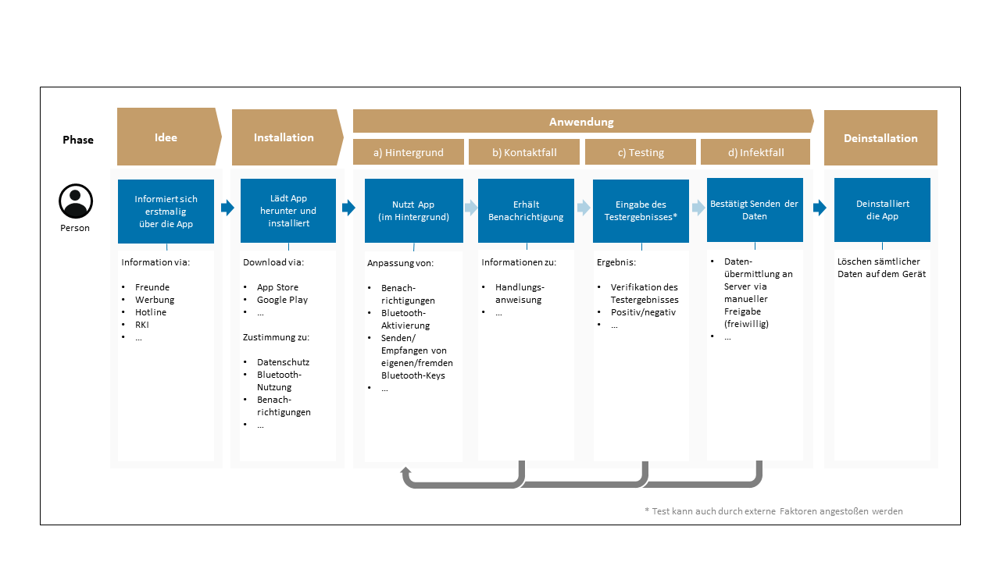

# INHALTSVERZEICHNIS
1.  [EINLEITUNG](#einleitung)
2.  [USER JOURNEY](#user-journey)
    1.  [Beschreibung der Nutzungsprofile (Stakeholder)](#beschreibung-der-nutzungsprofile-stakeholder)
    2.  [User Journey](#user-journey-1)
3.  [FUNKTIONSBESCHREIBUNG](#funktionsbeschreibung)
    1.  [Übersicht der Epics](#übersicht-der-epics)
    2.  [Übersicht der User Stories](#übersicht-der-user-stories)
          1.  [Anbahnung und Installation (Onboarding-Prozess)](#anbahnung-und-installation-onboarding-prozess)
          2.  [Informationen und Instruktionen zur Nutzung der Applikation](#informationen-und-instruktionen-zur-nutzung-der-applikation)
          3.  [Nutzung im Regelprozess](#nutzung-im-regelprozess)
          4.  [Kontaktfall (Begegnung mit infizierter Person)](#kontaktfall-begegnung-mit-infizierter-person)
          5.  [Covid-19-Testergebnismeldung](#covid-19-testergebnismeldung)
          6.  [Auslösen einer Warnung](#auslösen-einer-warnung)
          7.  [Parametrisierung](#parametrisierung)
          8.  [Technische Unterstützung](#technische-unterstützung)
          9.  [Barrierefreiheit](#barrierefreiheit)
          10. [Content Management](#content-management)

HINWEIS: Dieses Scoping-Dokument ist auch [auf Englisch](../scoping_document.md) verfügbar. 

# EINLEITUNG
Ziel der Corona-Warn-App ist es, SARS-CoV-2-Infektionsketten schnellstmöglich zu erkennen und zu durchbrechen. Personen sollen zuverlässig und schnell über Begegnungen mit anderen infizierten Personen und damit mögliche Übertragungen des Virus informiert werden, damit sie sich freiwillig isolieren können, um damit zu einer Eindämmung der SARS-CoV-2-Pandemie beizutragen.

Dieses Dokument beschreibt die funktionalen Anforderungen an die Gestaltung der App aus einer fachlichen und prozessualen Sicht. Die Beschreibung ist in der aktuellen Version inhaltlich auf das erste Release begrenzt und eine initiale Version.

In der Gesamtplanung ist die Veröffentlichung weiterer Dokumente aus der Entwicklung vorgesehen, um frühzeitig Rückmeldungen zu erhalten und gegebenenfalls aufzunehmen. Nachfolgend werden zunächst das Release-Architektur-Dokument sowie der Backend-Source-Code alpha verfügbar gemacht.

Die Definition und Gliederung der Anforderungen folgen einer personenzentrierten Methodik. Dabei erfolgt die Gestaltung des gesamten Prozessablaufs aus Sicht derjenigen, welche die App nutzen, bzw. der im Prozess eingebundenen Stakeholder. Das Ziel ist es, die Bedürfnisse aller genannten Beteiligten so abzubilden, dass eine hohe Akzeptanz erreicht wird und die jeweiligen Funktionen intuitiv bedienbar sind.

Anhand einer User Journey (Nutzungsreise) sind die Interaktionspunkte und das Erlebnis während der Nutzung aufgezeigt. Die daraus entstehenden Anforderungen werden sogenannten Epics (Beschreibung einer Anforderung auf einer hohen Abstraktionsebene) zugeordnet. Die Epics beschreiben die einzelnen Kontakt-Ereignisse sowie übergreifende Funktionalitäten im gesamten Prozess, die für die Nutzung und Akzeptanz der App erforderlich sind. Aus den Epics heraus werden die detaillierten Anforderungen in Form sogenannter User Stories (eine in Alltagssprache formulierte Software-Anforderung) abgeleitet. Die einzelnen Anforderungen werden so strukturiert in den Entwicklungsprozess gebracht.

# USER JOURNEY

## Beschreibung der Nutzungsprofile (Stakeholder)
Folgende wesentliche Nutzungsprofile bzw. Stakeholder sind in die User Journey bzw. in den Gesamtprozess eingebunden und in ihrer Rolle beschrieben:

#### App-Bedienung
Alle Personen, welche die App benutzen: Werden über mögliche Begegnungen mit infizierten Personen informiert, verifizieren eigene Testergebnisse bzw. warnen dann alle Personen, denen sie begegnet sind, freiwillig und pseudonym.

#### Hotlines
Unterstützen Personen bei der Bedienung der App in der Beantwortung von Fragestellungen zur Nutzung der App, zur Technik sowie zum Datenschutz und geben auf Nachfrage verhaltensbezogene Informationen sowie weitere Informationsmöglichkeiten im Kontakt- bzw. Infektionsfall weiter.
Unterstützen bei Verifikation und Freischaltung von Testergebnissen in der App für infizierte Personen und können diesen die Kontaktaufnahme mit dem zuständigen Gesundheitsamt empfehlen.

#### Robert Koch-Institut (RKI)
Stellt epidemiologische Informationen und Handlungsempfehlungen für die Bedienung der App zur Verfügung (Content). Bestimmt die Parameter für die Messung der Kontakte (im Rahmen der technischen Möglichkeiten durch die API).
 
## User Journey
Die Nutzung der App wird aufgrund von nacheinander stattfindenden Kontakt-Ereignissen und Interaktionen von Personen in verschiedene Phasen eingeteilt. Zu jeder Phase sind den Personen Motivationen oder Anforderungen zugeordnet, die ihre Erwartungen an die Funktionsweise erfüllen und intuitiv durch den Prozess leiten.

#### Phase *Idee*
In dieser Phase entscheidet eine Person, sich über die App zu informieren. Das kann über unterschiedliche Quellen erfolgen. In dieser Phase haben die Personen ggf. verschiedene Fragestellungen zur Nutzung der App (Anwendung, Datenschutz, Barrierefreiheit etc.). Diese sollen bereits vor dem Download beantwortet werden können (Hotline, Informationen auf Internetseiten des RKI und des BMG, App Store/Google Play Store).

#### Phase *Installation*
Eine Person entscheidet sich zum Download der App (App Store/Google Play Store) und wird nach der technischen Installation beim erstmaligen Öffnen der App durch eine Einführung begleitet. In der Einführungsphase erhält die Person eine Übersicht über die Funktionsweise, Nutzungsbedingungen und Datenschutzbestimmungen sowie erforderliche Einwilligungen, Einstellungen und Benachrichtigungen.

#### Phase *Anwendung*
Die Phase der Anwendung ist in vier weitere Bereiche unterteilt, in welchen die Person unterschiedliche Bedürfnisse hat.

1. **Hintergrund**

   Im Ruhezustand (Idle Mode) des Mobiltelefons läuft die Anwendung im Hintergrund und speichert für die Person automatisiert und verschlüsselt die in der Nähe befindlichen Pseudo-IDs anderer Personen anhand definierter Parameter über Entfernung und Dauer des Kontaktes. In regelmäßigen Abständen holt sich die App vom Server eine Liste der Pseudo-IDs der sich freiwillig infiziert gemeldeten Personen und vergleicht diese mit den gespeicherten Pseudo-IDs im Gerät, um einen möglichen Kontakt zu ermitteln.

2. **Kontaktfall**

   Im festgestellten Kontaktfall zu infizierten Personen erhält die Person jeweils eine Benachrichtigung und verhaltensbezogene Empfehlungen. Hier kann zum Beispiel die Kontaktaufnahme mit ärztlichem Fachpersonal, mit dem zuständigen Gesundheitsamt und/oder die freiwillige häusliche Isolation empfohlen werden.

3. **Testing**

   Im Fall eines durchgeführten Tests auf eine SARS-CoV-2-Infektion kann die Person über die App den digitalen Testinformationsprozess starten und damit über das ermittelte Testergebnis benachrichtigt werden.

4. **Infektfall**

   Im Fall eines positiven SARS-CoV-2-Befunds kann eine Person freiwillig die in der App gespeicherten eigenen pseudonymen Warn-IDs veröffentlichen, damit andere Personen, die die App nutzen, auf ihrem eigenen Smartphone abgleichen können, ob sie mit der infizierten Person in Kontakt standen.

#### Phase *Deinstallation*
Eine Person kann die App jederzeit deinstallieren. Alle in der App gespeicherten Daten werden vollständig gelöscht.

# FUNKTIONSBESCHREIBUNG
## Übersicht der Epics
Die Funktionen der Applikation sind in Prozessphasen der Nutzung (mit direktem Bezug zur User Journey) und übergreifende Unterstützungsprozesse unterteilt. Eine Übersicht der Epics ist nachfolgend dargestellt:

#### Prozessphasen der Nutzung
| #  |   Epic | Beschreibung |
|---:|--------|--------------|
|  1 | Anbahnung und Installation (Onboarding-Prozess) | Sämtliche Prozesse, die insbesondere bei erstmaliger Nutzung der Applikation erfolgen (z.B. Zustimmung Datenschutz, Sprachauswahl)
|  2 | Informationen und Instruktionen zur Nutzung der Applikation | Hilfestellungen zur Nutzung der Applikation (z.B. Anwendungshandbuch, Tutorial) sowie Informationen zum Impressum der Applikation
|  3 | Nutzung im Regelprozess | Funktionen der Applikation im "idle mode" (z.B. Aktivierung/Deaktivierung, Anpassung von Einstellungen, Überwachung von App-Aktivität)
|  4 | Kontaktfall (Begegnung mit infizierter Person) | Funktionen rund um Kontaktpunkte (z.B. Benachrichtigungen, Handlungsempfehlungen)
|  5 | Covid-19-Testergebnismeldung | Funktionen im Zusammenhang mit der Testergebnismeldung
|  6 | Auslösung einer Warnung | Prozess zur Auslösung einer Warnung im Falle eines positiven Testergebnisses

#### Supportprozesse
| #  |   Epic | Beschreibung |
|---:|--------|--------------|
|  7 | Parametrisierung | Parameter der Kontaktpunktdefinition
|  8 | Technische Unterstützung | Support-Prozesse (z.B. Hotlines)
|  9 | Barrierefreiheit | Apps von Trägern öffentlicher Gewalt müssen dem Behindertengleichstellungsgesetz (BGG) nach barrierefrei sein (§ 12). Apps sollen von allen Menschen mit Behinderungen bedient werden können.
| 10 | Content-Management | Zur Anpassung und Aktualisierung von Inhalten in der Applikation (Texte, Links, Hotlines etc.)

## Übersicht der User Stories
Die Anforderungen an die Corona-Warn-App, die den fachlichen Umfang der Anwendung definieren, sind nachfolgend in der üblichen Form aus Sicht der nutzenden Personen formuliert, sofern nicht anders angegeben:

_„Als \<Stakeholder> möchte ich <Handlung durchführen>, um <gewünschtes Ergebnis zu erzielen>.“_

Die zugehörigen Akzeptanzkriterien ergänzen die Spezifikation der Anforderungen, indem sie Bedingungen definieren, die die Software erfüllen muss, um die Bedürfnisse der nutzenden Personen zu befriedigen.

### Anbahnung und Installation (Onboarding-Prozess)
| # User Story ID | User Story | Akzeptanzkriterien |
|-----------------|------------|--------------------|
| E01.01          | Bei der Nutzung der App möchte ich beim erstmaligen Start der Applikation eine Einleitung zur Funktionsweise der Applikation erhalten (App-Motivation). | 1. Einführung in die Funktionsweise der App wird bei erstmaligem Start der Applikation angezeigt. 
 2. Einführung in die Funktionsweise der App wird bei weiteren Startvorgängen nicht angezeigt. 
 3. Die erklärenden Inhalte sind in den jeweiligen Funktionsbereichen zur Nutzung vorhanden.
| E01.02          | Bei der Nutzung der App möchte ich beim erstmaligen Start der Applikation über die Nutzungsbedingungen und Datenschutzbestimmungen (Data Protection Screen) informiert werden und meine Zustimmung geben, um über den Umgang mit meinen Daten innerhalb der Anwendung aufgeklärt zu sein. | 1. Mit Nutzung der App akzeptiert die Person die Nutzungsbedingungen und Datenschutzbestimmungen. 
 2. Die Nutzungsbedingungen sind innerhalb der App einsehbar. 
 3 Die Abfrage erfolgt nur bei der erstmaligen Nutzung.
| E01.03          | Bei der erstmaligen Nutzung der App möchte ich gefragt werden, ob ich der Erstellung pseudonymer IDs und deren Aussendung an Geräte in meiner Nähe durch die App zustimme, damit ich über die Funktionsweise der Applikation informiert bin. | 1. Eine Bestätigung der Erstellung pseudonymer IDs und deren Aussendung an Geräte in der Nähe durch die Applikation ist Voraussetzung für die App-Nutzung. 
 2. Nach der erstmaligen Nutzung erfolgt die Abfrage nicht.
| E01.04          | Bei der erstmaligen Nutzung der App möchte ich gefragt werden, ob die Applikation auf die Bluetooth-Funktion des Smartphones zugreifen darf, damit ich die mobiltelefonseitige Nutzung der Applikation kontrollieren kann. | 1. Eine Bestätigung der Bluetooth-Nutzung (BLE) erfolgt durch die Nutzung der Applikation.
| E01.05          | Bei der erstmaligen Nutzung der App möchte ich gefragt werden, ob die Applikation mir Benachrichtigungen schicken darf, damit in verschiedenen Situationen Push-Notifications ausgegeben werden können. | 1. Eine Abfrage zu den Benachrichtigungseinstellungen der Applikation findet vor erstmaliger Nutzung statt. 
 2. Nach der erstmaligen Nutzung erfolgt die Abfrage nicht.
| E01.06          | Bei der erstmaligen Nutzung der App möchte ich meine Sprache angezeigt bekommen, damit die Nutzung der App für mich verständlich ist. | 1. Erkennung der eingestellten Systemsprache wird durchgeführt. 
 2. Wenn die erkannte Systemsprache nicht im Content hinterlegt ist, wird im Default Englisch ausgewählt. 
 3. In der ersten Version der App ist Mehrsprachigkeit vorgesehen.
| E01.07          | Bei der Nutzung der App möchte ich bereits während des Onboardings Hilfen und Einstellungen zur Barrierefreiheit bekommen, um die App nutzen zu können. | 1. Die Barrierefreiheit wird im Rahmen der Möglichkeiten der Version des jeweils hinterlegten Betriebssystems verfügbar gemacht.

### Informationen und Instruktionen zur Nutzung der Applikation
| # User Story ID | User Story | Akzeptanzkriterien |
|-----------------|------------|--------------------|
| E02.01          | Bei der Nutzung der App möchte ich Zugriff auf eine FAQ-Liste haben, um mir bei Fragen zur Applikation selbst weiterhelfen zu können. | 1. Ein Link auf eine Internetseite mit FAQs ist im Applikationsmenü hinterlegt.
| E02.02          | Bei der Nutzung der App möchte ich Zugriff auf eine Anleitung zur Applikation haben, um die Anwendung und ihre Funktionen zu verstehen. | 1. Ein Link auf eine Internetseite mit Nutzungshandbuch ist im Applikationsmenü hinterlegt.
| E02.03          | Bei der Nutzung der App möchte ich Zugriff auf ein Erklärvideo zur Applikation haben, um die Anwendung und ihre Funktionen zu verstehen. | 1. Ein Link auf eine Internetseite mit Erklärvideo ist im Applikationsmenü hinterlegt.
| E02.04          | Bei der Nutzung der App möchte ich das Impressum der Applikation einsehen können, um zu sehen, wer für die Entwicklung und Inhalte der Applikation verantwortlich ist. | 1. Es gibt ein Untermenü "Impressum". 
 2. Das Impressum beinhaltet die üblichen Angaben zur Impressumspflicht.
| E02.05          | Bei der Nutzung der App möchte ich Nutzungsbedingungen und Datenschutzinformationen jederzeit einsehen können. | 1. Die App bietet einfachen Zugriff auf Nutzungsbedingungen und Datenschutzinformationen.
| E02.06          | Bei der Nutzung der App möchte ich die verschiedenen Hotlines zu technischen, datenschutzbezogenen, gesundheitsbezogenen und psychologischen Fragestellungen sowie zur Verifikation eines Testergebnisses angezeigt bekommen, damit ich weitere Informationen erhalte oder Fragen beantwortet bekomme. | 1. Die App bietet einfachen Zugriff auf die Telefonnummern der Hotlines (für technische, datenschutzbezogene, gesundheitsbezogene und psychologische Fragestellungen). 
 2. Die zeitliche Erreichbarkeit der Hotlines (z.B. 24/7) wird angezeigt. 
 3. Telefonnummern können direkt aus der App gewählt werden.

### Nutzung im Regelprozess
| # User Story ID | User Story | Akzeptanzkriterien |
|-----------------|------------|--------------------|
| E03.01          | Bei der Nutzung der App möchte ich die Applikation aktivieren und deaktivieren können, um die Funktion ein- und auszuschalten. | 1. Eine Umschaltfläche schaltet die Funktion (Bluetooth im Hintergrund und Hash-Generierung) ein und aus. 
 2. Die Konsequenzen des Ein-/Ausschaltens werden erklärt.
| E03.02          | Bei der Nutzung der App möchte ich die App in den Auslieferungszustand zurücksetzen können, damit ich sie neu konfigurieren kann. | 1. Die App kann über eine Einstellung in den Auslieferungszustand zurückgesetzt werden, die gespeicherten Traces der letzten Tage bleiben aber erhalten.
| E03.03          | Bei der Nutzung der App möchte ich die Applikationseinstellungen (Zugriffsrechte, z.B. Bluetooth, Benachrichtigungen) in einem Menü anpassen können, um Funktion und Zugriffe der Applikation verwalten zu können. | 1. Ein Menü zu Applikationseinstellungen kann durch die nutzende Person aufgerufen werden. 
 2. Die Benachrichtigungen können ein- und ausgeschaltet werden. 
 3. Die Zugriffsrechte der Applikation auf Bluetooth können durch die Person erteilt und entzogen werden. 
 4. Vor Deaktivierung der Zugriffsrechte erhalte ich Informationen darüber, welche Funktionen der App dadurch nicht mehr (vollumfänglich) funktionieren.

### Kontaktfall (Begegnung mit infizierter Person)
| # User Story ID | User Story | Akzeptanzkriterien |
|-----------------|------------|--------------------|
| E04.01          | Bei der Nutzung der App möchte ich informiert werden, wenn eine Person, zu der ich Kontakt hatte, sich als infiziert gemeldet hat. Damit kann ich geeignete Maßnahmen treffen, um die Verbreitung des Virus zu stoppen. | 1. Eine Notifikation durch die Applikation wird an die möglicherweise betroffene Person verschickt. 
 2. Die Notifikation informiert die möglicherweise betroffene Person über eine Risikoänderung (abhängig von der zur Verfügung gestellten API-Funktion).
| E04.02          | Bei der Nutzung der App möchte ich im Kontaktfall Handlungsanweisungen durch die Applikation bekommen, um mein Verhalten an die Empfehlungen des RKI anzupassen. | 1. Die Notifikation führt zu hinterlegten Handlungsempfehlungen für den Kontaktfall.

### Covid-19-Testergebnismeldung
| # User Story ID | User Story | Akzeptanzkriterien |
|-----------------|------------|--------------------|
| E05.01          | Als RKI möchte ich, dass ausschließlich positiv getestete Personen einmalig eine Warnung auslösen können, um Missbrauch zu vermeiden. | 1. Nur positive Tests können eine Warnung auslösen. 
 2. Für jeden Test kann nur einmal eine Warnung ausgelöst werden.
| E05.02          | Bei der Nutzung der App möchte ich im Falle eines positiven Testergebnisses Informationen über die Erkrankung und nötige nächste Schritte bekommen, um mein Verhalten an die Handlungsempfehlungen des RKI anpassen zu können. | 1. Eine Benachrichtigung über den Eingang des Testergebnisses wird angezeigt. 
 2. In der App wird ein Infotext mit definiertem Inhalt angezeigt (z.B. Informationen zum Ausgang des Testergebnisses, Informationen über erforderliche Maßnahmen, eine Hotline-Nummer).

### Auslösen einer Warnung
| # User Story ID | User Story | Akzeptanzkriterien |
|-----------------|------------|--------------------|
| E06.01          | Bei der Nutzung der App möchte ich einen vom medizinischen Fachpersonal oder Test-Center ausgehändigten QR-Code scannen können, damit mir später das Testergebnis in der Warn-App zur Verfügung gestellt werden kann. | 1. Ein auf dem Flyer des medizinischen Fachpersonals oder Test-Centers vorhandener QR-Code kann mit der Warn-App gescannt werden. 
 2. Erklärungstext wird angezeigt.
| E06.02          | Bei der Nutzung der App möchte ich innerhalb der Warn-App informiert werden, sobald ein Testergebnis verfügbar ist. | 1. Die Person erhält eine Benachrichtigung, sobald ein verifiziertes Testergebnis vorliegt. 
 2. Die Benachrichtigung enthält nicht das Ergebnis positiv oder negativ.
| E06.03          | Bei der Nutzung der App möchte ich, dass bei Vorliegen meines positiven Testergebnisses nach meiner Zustimmung die pseudonymisierten IDs, auf deren Basis ich an den vergangenen Tagen für andere Personen sichtbar war, an den Warn-Server übermittelt werden, damit Kontaktpersonen durch ihre Apps gewarnt werden können. | 1. IDs können pseudonymisiert an den Warn-Server übermittelt werden. 
 2. Die Übermittlung ist nur möglich, sofern zuvor eine Verifikation erfolgreich durchgeführt wurde. 
 3. Die Übermittlung ist nur möglich, sofern die Person vorher zugestimmt hat.
| E06.04          | Bei der Nutzung der App möchte ich neben dem digitalen auch einen manuellen Prozess, z.B. über ein Call-Center nutzen können, damit auch ohne einen vorhandenen QR-Code die pseudonymisierten IDs, unter denen ich in den vergangenen Tagen für andere Personen sichtbar war, an den Warn-Server übermittelt werden, so dass Kontaktpersonen durch ihre Apps gewarnt werden können. | 1. Die zuständige Stelle kann eine TAN generieren und diese der Person mitteilen. (Generiert wird die TAN von einem Server, nicht durch das Call-Center selbst.)
| E06.05          | Bei der Nutzung der App möchte ich die Möglichkeit zur Eingabe einer TAN innerhalb der App haben, damit ich die mir telefonisch mitgeteilte TAN zur Zuordnung meines Testergebnisses zu der von mir genutzten Instanz der App nutzen kann. | 1. Die Eingabe einer TAN innerhalb der App ist möglich. 
 2. Es wird überprüft und zurückgemeldet, ob die eingegebene TAN korrekt war (zu prüfen, ob technisch möglich).
| E06.06          | Bei der Nutzung der App möchte ich, dass ich nach der Verifikation der TAN meine pseudonymen IDs freiwillig teilen und etwaige Kontaktpersonen warnen kann. | 1. IDs können pseudonymisiert an den Warn-Server übermittelt werden. 
 2. Die Übermittlung ist nur möglich, sofern zuvor eine Verifikation erfolgreich durchgeführt wurde. 
 3. Die Übermittlung ist nur möglich, sofern die Person vorher zugestimmt hat.

### Parametrisierung
| # User Story ID | User Story | Akzeptanzkriterien |
|-----------------|------------|--------------------|
| E07.01          | Als RKI möchte ich die Parameter zur Risiko-Score-Bestimmung (im Rahmen der technischen Möglichkeiten durch die API) einstellen können, um stets den aktuellen Forschungsergebnissen zur Virusübertragung zu entsprechen. | 1. In Abhängigkeit von der bereitgestellten API können Schwellenwerte konfiguriert werden. 
 2. Die Anpassung wird auf den Endgeräten vorgenommen, ohne dass ein Update der App erforderlich ist.

### Technische Unterstützung
| # User Story ID | User Story | Akzeptanzkriterien |
|-----------------|------------|--------------------|
| E08.01          | Bei der Nutzung der App möchte ich eine Hotline kontaktieren können, um technische Probleme mit der Applikation zu lösen. | 1. Die Telefonnummer der technischen Hotline ist in der Applikation hinterlegt.

### Barrierefreiheit
| # User Story ID | User Story | Akzeptanzkriterien |
|-----------------|------------|--------------------|
| E09.01          | Bei der Nutzung der App möchte ich eine Sprachausgabe nutzen können, um die Applikation (z.B. bei fehlendem oder eingeschränktem Sehvermögen) nutzen zu können. | 1. Die Barrierefreiheit bzgl. Sprachausgabe wird im Rahmen der Möglichkeiten der Version des jeweils hinterlegten Betriebssystems verfügbar gemacht.
| E09.02          | Bei der Nutzung der App möchte ich gute Kontraste, veränderbare Schriftgrößen und eine gut lesbare Schriftart haben, um die Texte der Applikation gut lesen zu können. | 1. Die Barrierefreiheit bzgl. Kontraste und Schrift wird im Rahmen der Möglichkeiten der Version des jeweils hinterlegten Betriebssystems verfügbar gemacht.
| E09.03          | Bei der Nutzung der App möchte ich, dass mir die Inhalte in einfacher Sprache zur Verfügung gestellt werden, damit ich leicht verstehe, wie ich die App nutzen kann und warum ich es tun sollte. | 1. Die Barrierefreiheit wird im Rahmen des Content-Managements berücksichtigt.

### Content Management
| # User Story ID | User Story | Akzeptanzkriterien |
|-----------------|------------|--------------------|
| E10.01          | Als RKI möchte ich die Inhalte der Applikation zentral verwalten, um Aktualisierungen von Texten, Links, Hotlines etc. einmalig für alle Stellen in der App durchführen zu können. | 1. Das Content-Management erfolgt auf Grundlage der Anforderungen des RKI 
 2. Der Content wird auf statische und dynamische Inhalte entsprechend der technischen Machbarkeit differenziert 
 3. Aktualisierungen erfolgen in der ersten Version über ein App-Update.
