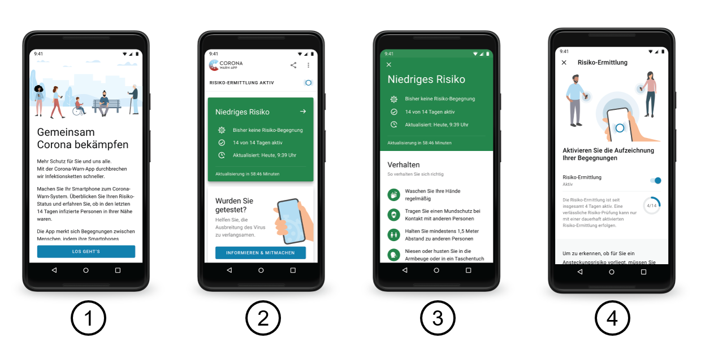
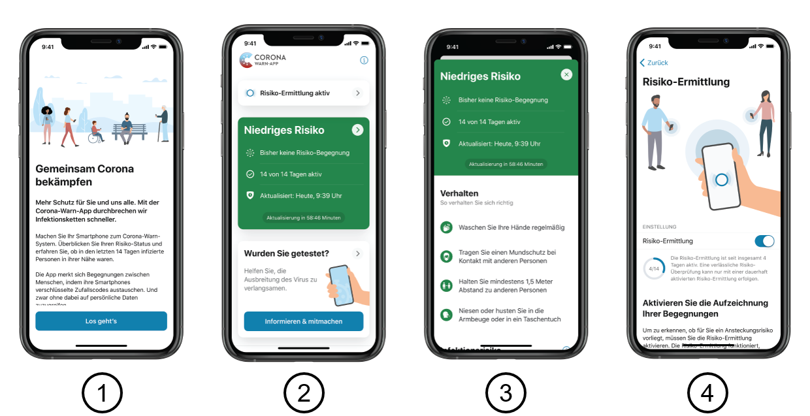

# Corona-Warn-App User Interface Screens

The design of the Corona-Warn-App combines the requirements of the German citizens, the German federal government, and the virologists with the latest technological capabilities. At the same time, it provides a user experience that is easy to understand and to follow. The design of the central overview, the usage of signal color to highlight the current risk level, as well as the explanatory illustrations ensure an intuitive consumption of the app.

We highly appreciate your feedback on these screens! Though, please, bear in mind that major changes cannot be implemented without a decision by the Ministry of Health and the Robert Koch Institute. Further documentation, e.g. about questions of accessibility, will follow soon.

## User Validation

We conducted usability tests with representative user groups and improved the design based on their feedback. Furthermore, Apple and Google were involved to optimize the design for iOS and Android usage.

## Accessibility

Accessibility of the application was one of our top priorities when designing and implementing the app. Once available, it will support all accessibility features within the operating systems such as zooming to enlarge text, screen readers like VoiceOver for iOS and TalkBack for Android, or special color contrasts.

## Screens

Figure 1: UI Screens for Google Android [(high-resolution images)](images/ui_screens/android/)

Figure 2: UI Screens for Apple iOS [(high-resolution images)](images/ui_screens/ios/)

## Screen Descriptions

1. This is the first screen ([Android](https://github.com/corona-warn-app/cwa-documentation/raw/master/images/ui_screens/android/cwa_onboarding_android.png), [iOS](https://github.com/corona-warn-app/cwa-documentation/raw/master/images/ui_screens/ios/cwa_onboarding_ios.png)) that a user sees when launching the app for the first time. It describes the purpose of the app and is only displayed once after the very first app start.
2. The home screen ([Android](https://github.com/corona-warn-app/cwa-documentation/raw/master/images/ui_screens/android/cwa_home_android.png), [iOS](https://github.com/corona-warn-app/cwa-documentation/raw/master/images/ui_screens/ios/cwa_home_ios.png)) is the entry point to the app for further starts. It provides the user with the current risk status. In case of a positive test, it offers the opportunity to submit the diagnosis keys to the server with a QR code or a TeleTAN. Further, it allows the sharing of the app with others, offers additional information, as well as the app setting button.
3. The detailed view ([Android](https://github.com/corona-warn-app/cwa-documentation/raw/master/images/ui_screens/android/cwa_detail_android.png), [iOS](https://github.com/corona-warn-app/cwa-documentation/raw/master/images/ui_screens/ios/cwa_detail_ios.png)) of the risk level repeats the information displayed on the home screen. It provides the user with behavioral recommendations in line with his current infection risk. Moreover, it explains how the infection risk was determined.
4. The settings of the risk calculation screen ([Android](https://github.com/corona-warn-app/cwa-documentation/raw/master/images/ui_screens/android/cwa_risk_calculation_android.png), [iOS](https://github.com/corona-warn-app/cwa-documentation/raw/master/images/ui_screens/ios/cwa_risk_calculation_ios.png)) can be accessed via the home screen as well as via the application settings. It explains the risk calculation and allows users to control it. In case of a significant malfunction of the risk calculation (e.g. the deactivation of Bluetooth) the user will be informed and provided with a solution.
